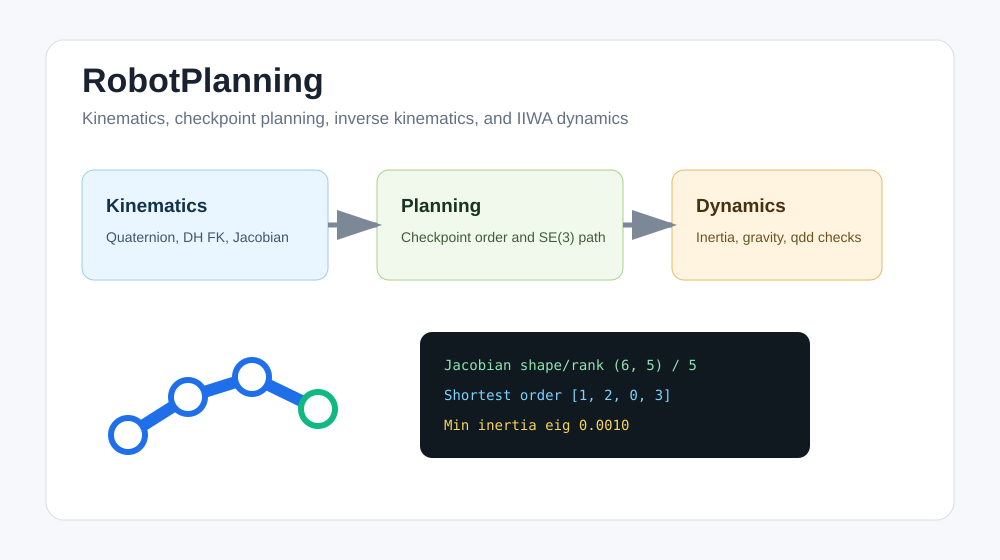

# RobotPlanning

[English README](README_en.md)

RobotPlanning 把多个机器人算法模块整理成一个根目录级 ROS 2 工作空间。项目覆盖四元数转换、YouBot 机械臂运动学、雅可比矩阵、检查点路径规划、逆运动学轨迹生成，以及 KUKA IIWA14 动力学建模与验证。



## 简历亮点

- 覆盖机器人运动学、雅可比矩阵、检查点路径规划、逆运动学和 IIWA14 动力学验证。
- 将 ROS 2 工作空间与无 ROS NumPy 快速演示分层，既能展示完整机器人栈，也能在普通机器上快速验证。
- 提供 Docker/本地 ROS/轻量 demo 三种运行路径，适合 Robotics、Motion Planning 和工程复现能力展示。

## 复现边界

- `bash scripts/run_project.sh quick` 只依赖 Python + NumPy，可在非 ROS 环境快速运行。
- RViz、Gazebo、MoveIt 2 演示需要 Ubuntu 20.04 + ROS 2 Foxy 或 Docker 环境。
- CI 使用无 ROS 快速演示和脚本语法检查，避免图形仿真依赖导致不稳定。

## 快速上手索引

| 目标 | 入口 |
| --- | --- |
| 快速无 ROS 演示 | `bash scripts/run_project.sh quick` |
| 复用共享 conda 环境 | `conda run -n codex_python bash scripts/run_project.sh quick` |
| Docker 完整验证 | `bash scripts/run_project.sh docker` |
| 本地 ROS 构建 | `bash scripts/run_project.sh ros-build` |
| 环境检查 | `bash scripts/check_environment.sh` |

## 项目内容

| 模块 | 包 | 主要功能 |
| --- | --- | --- |
| YouBot 运动学与 ROS 服务 | `quaternion_conversion`, `quaternion_conversion_interfaces`, `youbot_fk_broadcaster`, `youbot_kinematics` | 四元数转换服务、YouBot 正运动学、TF 广播、雅可比矩阵计算 |
| 规划与动力学 | `youbot_motion_planning`, `iiwa_dynamics`, `iiwa_trajectory_analysis` | 检查点路径排序、SE(3) 插值、位置逆运动学、IIWA 动力学与加速度分析 |
| 机器人模型与可视化资源 | `robot_description`, `youbot_simulator`, `youbot_trail_visualizer`, `iiwa_ros2_gazebo`, `iiwa_ros2_moveit2` | URDF/Xacro 模型、RViz 配置、Gazebo 启动文件、MoveIt 2 配置 |

## 目录结构

```text
.
|-- quaternion_conversion/             # 四元数转换 ROS 服务节点
|-- quaternion_conversion_interfaces/  # 自定义 service 定义
|-- youbot_fk_broadcaster/             # YouBot 正运动学 TF 广播
|-- youbot_kinematics/                 # YouBot 正运动学与雅可比实现
|-- youbot_motion_planning/            # YouBot 检查点规划与 IK 轨迹
|-- iiwa_dynamics/                     # IIWA14 动力学实现与验证
|-- iiwa_trajectory_analysis/          # IIWA 轨迹播放与加速度分析
|-- robot_description/                 # YouBot 描述包
|-- youbot_simulator/                  # YouBot RViz/Gazebo 支持包
|-- youbot_trail_visualizer/           # RViz 轨迹可视化
|-- iiwa_ros2_gazebo/                  # IIWA Gazebo 包
|-- iiwa_ros2_moveit2/                 # IIWA MoveIt 2 配置包
|-- portfolio_robotics/                # 无 ROS 依赖的算法封装
|-- demos/lightweight_demo.py          # 只依赖 Python + NumPy 的终端演示
|-- scripts/run_project.sh             # 一键运行入口
|-- scripts/                           # 环境检查、构建和 ROS 启动脚本
|-- docs/reports/                      # 保留的项目报告
|-- docs/results/                      # 示例运行输出
|-- docker/ros2-foxy.Dockerfile        # 可复现的 ROS 2 Foxy Docker 环境
```

`build/`、`install/`、`log/` 等 ROS 生成目录已经被 git 忽略。

## 一键运行

最快的本地检查方式只需要 Python 3 和 NumPy：

```bash
bash scripts/run_project.sh
```

如果已经有共享 conda 环境，可以直接复用无 ROS 快速演示：

```bash
conda run -n codex_python bash scripts/run_project.sh quick
```

如果本机没有 ROS 2，推荐使用 Docker 完整验证 ROS 环境：

```bash
bash scripts/run_project.sh docker
```

可用启动模式：

| 命令 | 作用 |
| --- | --- |
| `bash scripts/run_project.sh` | 本地环境检查，并运行无 ROS 依赖的数值演示 |
| `bash scripts/run_project.sh docker` | 构建 Docker 镜像，在容器内构建 ROS 工作空间并运行 IIWA 动力学验证 |
| `bash scripts/run_project.sh ros-build` | 在本地 ROS 2 Foxy 环境中构建根工作空间 |
| `bash scripts/run_project.sh iiwa-validation` | 本地构建后运行 IIWA 动力学验证 |
| `bash scripts/run_project.sh youbot-fk` | 本地构建后启动 YouBot 正运动学 RViz 演示 |
| `bash scripts/run_project.sh youbot-planning` | 本地构建后启动 YouBot 路径规划 RViz 演示 |

## 环境要求

无 ROS 快速演示：

- Python 3
- NumPy

完整 ROS 运行环境：

- Ubuntu 20.04
- ROS 2 Foxy
- `colcon` 和 `ament_cmake`
- Python 包：`numpy`, `PyKDL`, `matplotlib`
- RViz/Gazebo/MoveIt 2 相关 ROS 包

Docker 模式会使用 `docker/ros2-foxy.Dockerfile` 构建可复现环境。脚本默认使用 `linux/amd64`，适配 ROS 2 Foxy 官方镜像；在 Apple Silicon 机器上也可以直接运行：

```bash
bash scripts/run_project.sh docker
```

如果需要修改 Docker 镜像名或平台：

```bash
DOCKER_IMAGE=my-robotics-stack:foxy bash scripts/run_project.sh docker
DOCKER_PLATFORM=linux/amd64 bash scripts/run_project.sh docker
```

## 本地 ROS 运行

在 Ubuntu 20.04 + ROS 2 Foxy 上，先 source ROS 环境，再构建：

```bash
source /opt/ros/foxy/setup.bash
bash scripts/run_project.sh ros-build
```

运行 IIWA 动力学验证：

```bash
bash scripts/run_project.sh iiwa-validation
```

启动 YouBot 正运动学 RViz 演示：

```bash
bash scripts/run_project.sh youbot-fk
```

启动 YouBot 路径规划与轨迹可视化：

```bash
bash scripts/run_project.sh youbot-planning
```

RViz 和 Gazebo 这类图形界面更适合在本地 Ubuntu 桌面环境运行；Docker 模式主要用于终端构建和数值验证。

## 运行验证结果

一键启动命令已在 2026-07-05 测试，运行日志保存在 `docs/results/`：

| 命令 | 状态 | 日志文件 |
| --- | --- | --- |
| `bash scripts/run_project.sh` | 通过 | `docs/results/run_quick_2026-07-05.txt` |
| `bash scripts/run_project.sh docker` | 通过 | `docs/results/run_docker_2026-07-05.txt` |

验证摘要：

- 本地 quick 模式完成环境检查，并成功运行无 ROS 依赖的数值演示。
- Docker 模式成功构建 `robotics-portfolio:foxy` 镜像，在容器内完成 12 个 ROS 包的编译，并正常结束 IIWA 动力学验证。
- 汇总报告位于 `docs/results/run_validation_summary_2026-07-05.md`。

## 示例输出

快速演示会输出确定性的数值检查，例如：

```text
Quaternion demo
  Euler ZYX [rad]      roll=+0.0000 pitch=+0.7854 yaw=+0.0000
  Rodrigues vector     [+0.0000, +0.4142, +0.0000]

YouBot kinematics demo
  End-effector xyz [m]  [-0.0378, +0.0330, +0.4490]
  Jacobian shape/rank   (6, 5) / 5

IIWA dynamics demo
  Inertia symmetry err  0.00e+00
```

完整 ROS 验证会在构建完成后运行 IIWA 动力学校验，并输出与参考实现对比的误差指标。
