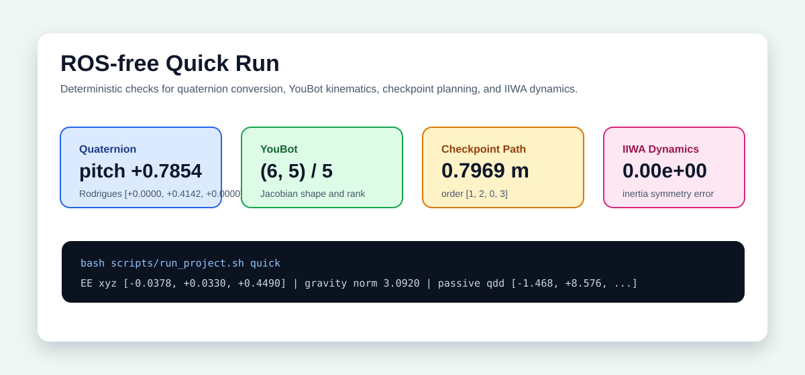
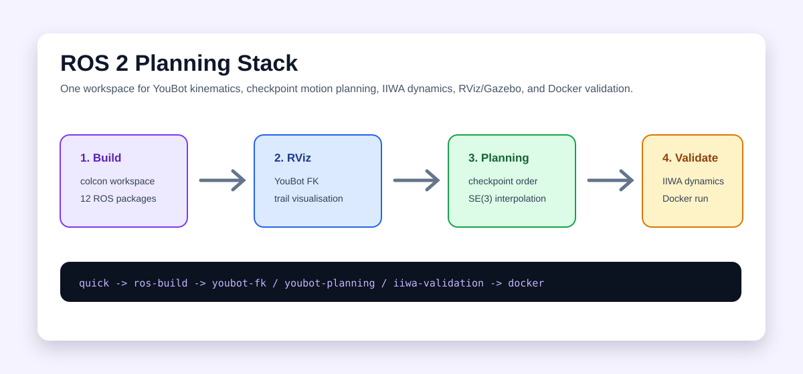
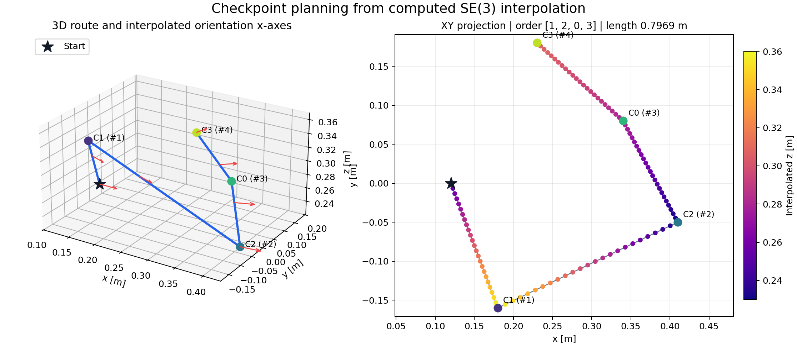
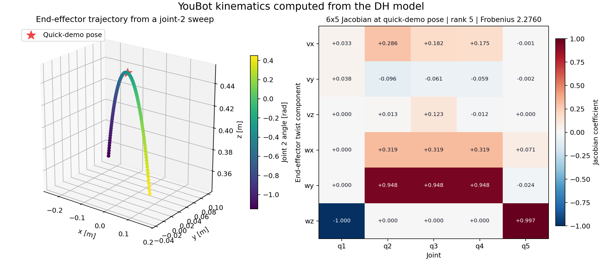

# RobotPlanning

[中文](README.md)

RobotPlanning is a ROS 2 robotics planning and dynamics workspace covering quaternion conversion, YouBot kinematics, checkpoint ordering, SE(3) interpolation, inverse-kinematics trajectories, KUKA IIWA14 dynamics modelling, and Docker-based validation.

The project provides both a ROS-free numerical demo and a full ROS 2 Foxy workflow. The quick demo checks the core algorithms in a normal Python environment; the full workflow covers RViz, Gazebo, MoveIt 2, and IIWA dynamics validation.


## Features

| Module | Capability |
| --- | --- |
| Quaternion conversion | Converts to ZYX Euler angles and Rodrigues vectors |
| YouBot kinematics | Provides forward kinematics, DH-table wrappers, and 6x5 Jacobian calculation |
| Path planning | Implements checkpoint ordering, path length calculation, and SE(3) interpolation |
| IIWA dynamics | Models inertia, gravity, Coriolis terms, and passive acceleration |
| ROS workflow | Provides YouBot RViz demos, motion-planning launch files, IIWA validation, and Docker builds |

`portfolio_robotics/` is a pure-NumPy algorithm core with no ROS dependency. It decouples kinematics, dynamics, and planning from the middleware, allowing the same implementations to power the lightweight demo, numerical unit tests, and reproducible plots.

## Runtime Views

The ROS-free quick demo emits deterministic numerical results for fast algorithm verification and README metrics.



The full workflow builds the colcon workspace, runs RViz/Gazebo/MoveIt 2 demos, and closes the loop with IIWA dynamics validation.



## Results

| Item | Result |
| --- | --- |
| Quaternion pitch | `+0.7854 rad` |
| Rodrigues vector | `[+0.0000, +0.4142, +0.0000]` |
| YouBot end-effector xyz | `[-0.0378, +0.0330, +0.4490] m` |
| YouBot Jacobian | shape/rank = `(6, 5) / 5` |
| Checkpoint order | `[1, 2, 0, 3]` |
| Checkpoint path | `0.7969 m` |
| First interpolation point | `[+0.2260, -0.1380, +0.3340]` |
| IIWA inertia symmetry error | `0.00e+00` |
| IIWA gravity norm | `3.0920` |
| Supported modes | `quick`, `docker`, `ros-build`, `iiwa-validation`, `youbot-fk`, `youbot-planning` |

The path plot uses `shortest_path_order` to order the checkpoints and `interpolate_transform` to interpolate each SE(3) segment. The optimal order `[1, 2, 0, 3]`, total length `0.7969 m`, and 97 interpolated poses are all computed by the generation script.



The YouBot plot calls `youbot_forward_kinematics` over 121 joint-2 angles to produce the end-effector trajectory. Its heatmap is the actual matrix returned by `youbot_jacobian` at the quick-demo configuration (shape `(6, 5)`, rank `5`).



Result files:

- `docs/results/run_quick_2026-08-09.txt`
- `docs/results/run_validation_summary_2026-08-09.md`
- `docs/results/lightweight_demo.txt`

## Quick Start

ROS-free quick demo:

```bash
bash scripts/run_project.sh quick
```

Reuse an existing conda environment:

```bash
conda run -n codex_python bash scripts/run_project.sh quick
```

Regenerate the computed plots:

```bash
python scripts/generate_visuals.py
```

Docker validation:

```bash
bash scripts/run_project.sh docker
```

Local ROS 2 Foxy workflow:

```bash
bash scripts/run_project.sh ros-build
bash scripts/run_project.sh youbot-fk
bash scripts/run_project.sh youbot-planning
bash scripts/run_project.sh iiwa-validation
```

## Requirements

- Quick demo: Python 3 + NumPy
- Plot generation: Matplotlib
- Full ROS run: Ubuntu 20.04 + ROS 2 Foxy
- Optional: Docker, RViz, Gazebo, MoveIt 2, PyKDL, xacro

## Data Notes

The project does not require an external dataset. YouBot and IIWA models, launch files, RViz configs, rosbag samples, and the numerical demo are stored in the repository. `docs/results/` stores reproducible run summaries; `demos/lightweight_demo.py` is the main source for README metrics.

## Project Layout

```text
portfolio_robotics/        ROS-free algorithm wrappers
demos/                     Lightweight numerical demo
youbot_*                   YouBot kinematics, simulation, and visualisation packages
iiwa_*                     IIWA dynamics, Gazebo, and MoveIt packages
robot_description/         YouBot model files
scripts/                   Run, check, and build scripts
docker/                    ROS 2 Foxy Docker environment
docs/images/               README preview and runtime images
docs/results/              quick run and validation summaries
tests/                     Structure and numerical-correctness tests
```

## Tests

```bash
pytest tests/ -q
```
