# Q1
## a: Prove that every element of the rotation matrix is less than or equal to 1


Let $ \R\in\mathrm{SO}(3) $ be a rotation matrix. Then
$$
R^\top R = I.
$$
which implies that the columns (and, equivalently, the rows) of $R$ are orthonormal.

Write the $j$-th column of $R$ as $\mathbf{c}_j = (r_{1j}, r_{2j}, r_{3j})^\top$. From $R^\top R = I$ it follows that

$$
\mathbf{c}_j^\top\mathbf{c}_j= \sum_{i=1}^3 r_{ij}^2 = 1.
$$

so each column is a unit vector in $R^3$.

Since the sum of the three nonnegative numbers $r_{1j}^2, r_{2j}^2, r_{3j}^2$ equals $1$, each of them satisfies $r_{ij}^2 \le 1$. Hence, for all $i,j \in \{1,2,3\}$,
$$
|r_{ij}| \le 1.
$$
Therefore, every entry of a $3\times 3$ rotation matrix has absolute value at most $1$.


## b: Prove $R_{\mathbf{u},\theta}=R_{-\mathbf{u},-\theta}$
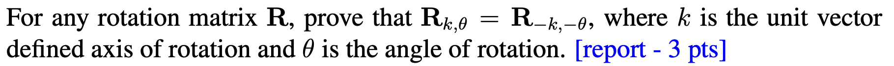

By Rodrigues’ rotation formula, the rotation matrix is
$$
R(\mathbf{u},\theta) \;=\; I + \sin\theta\, [\mathbf{u}]_\times + (1-\cos\theta)\,[\mathbf{u}]_\times^2,
$$
where $\mathbf{u}$ is a unit axis, $\theta$ is the rotation angle, and $[\mathbf{u}]_\times$ denotes the skew-symmetric matrix associated with $\mathbf{u}$.

Then, from the properties of skew-symmetric matrices and trigonometric functions,
$$
[-\mathbf{u}]_\times = -[\mathbf{u}]_\times,\quad [-\mathbf{u}]_\times^2 = [\mathbf{u}]_\times^2,\\ \sin(-\theta)=-\sin\theta,\quad \cos(-\theta)=\cos\theta,
$$
Substituting into $R(\mathbf{u},\theta)$ yields

$$
\begin{aligned}
R(-\mathbf{u},-\theta)
&= I + \sin(-\theta)\,[-\mathbf{u}]_\times + (1-\cos(-\theta))[-\mathbf{u}]_\times^2 \\
&= I + (-\sin\theta)(- [\mathbf{u}]_\times) + (1-\cos\theta)[\mathbf{u}]_\times^2 \\
&= I + \sin\theta\, [\mathbf{u}]_\times + (1-\cos\theta)[\mathbf{u}]_\times^2 \\
&= R(\mathbf{u},\theta).
\end{aligned}
$$

Therefore, $R_{\mathbf{u},\theta}=R_{-\mathbf{u},-\theta}$ for any unit axis $\mathbf{u}$.

## c: In coordinate frames $(a,b)$, what does each row of the matrix $^{a}\!R_b$ represent?

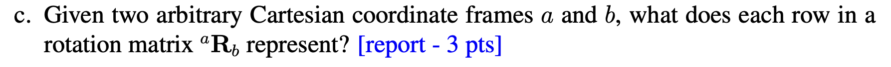

The rotation matrix $^{a}\!R_b$ converts the coordinate representation of the same geometric vector between frames:

$$
\mathbf{v}_a = {}^{a}\!R_b\, \mathbf{v}_b .
$$

Here $\mathbf{v}$ denotes a single geometric vector in space, while $\mathbf{v}_a$ and $\mathbf{v}_b$ are its coordinate column vectors in frames $a$ and $b$, respectively. The three columns of $^{a}\!R_b$ are exactly the coordinates, expressed in frame $a$, of the unit basis axes of frame $b$, namely $(\hat{\mathbf{x}}_b,\hat{\mathbf{y}}_b,\hat{\mathbf{z}}_b)$; the $j$-th column gives the components of $\hat{\mathbf{e}}_{b,j}$ in frame $a$.

Since
$$
({}^{a}\!R_b)^\top = {}^{b}\!R_a,
$$
and the columns of $^{b}\!R_a$ are the axes of frame $a$ expressed in frame $b$, it follows that the $i$-th **row** of $^{a}\!R_b$ is the coordinate row vector of the $i$-th unit axis of frame $a$ expressed in frame $b$.

Equivalently,

$$({}^{a}\!R_b)_{ij} = \hat{e}_{a,i} \cdot \hat{e}_{b,j},$$

Thus, $^{a}\!R_b$ collects the axes of frame $b$ in the coordinates of frame $a$ (by columns), while each row of $^{a}\!R_b$ lists the coordinates of the axes of frame $a$ in frame $b$.

## d: Derivations of relationships for rotation matrices
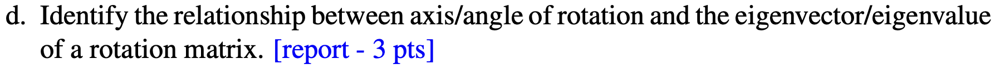

Let $\mathbf{R}\in \mathrm{SO}(3)$ denote a rotation in three dimensions. Write the rotation angle as $\theta$ and the rotation axis as $\mathbf{u}\in\mathbb{R}^3$ with $\|\mathbf{u}\|=1$, and let $[\mathbf{u}]_\times$ be the skew-symmetric matrix associated with $\mathbf{u}$.

By Rodrigues’ formula,
$$
R(\mathbf{u},\theta) \;=\; I + \sin\theta\, [\mathbf{u}]_\times + (1-\cos\theta)\,[\mathbf{u}]_\times^2,
$$

For any vector $\mathbf{x}$, using the vector triple-product identity and $\|\mathbf{u}\|=1$,
$$
\mathbf{[u]_\times^2x=u\times(u\times x)}=\mathbf{u(u^\top x)-x(u^\top u)}
$$
and, in particular, the skew-symmetric matrix satisfies
$$
[\mathbf{u}]_\times \mathbf{u} = \mathbf{u}\times \mathbf{u} = 0, [\mathbf{u}]_\times^2 = \mathbf{u}\mathbf{u}^\top-\mathbf{I}
$$

Substituting these into Rodrigues’ formula and multiplying both sides by $\mathbf{u}$ gives

$$
\begin{aligned}
R(\mathbf{u},\theta)\mathbf{u}&= \mathbf{u} + \sin\theta\,(\mathbf{[u]_\times}\mathbf{u}) + (1-\cos\theta)\,\mathbf{u}(\mathbf{u}^\top\mathbf{u}) \\
&= \mathbf{u} + \sin\theta*\mathbf{0} + (1-\cos\theta)\,\mathbf{u} \\
&= \mathbf{u}.
\end{aligned}
$$

Hence, the rotation axis $\mathbf{u}$ is an eigenvector of $R(\mathbf{u},\theta)$ with eigenvalue $1$; i.e., the axis direction is invariant under the rotation.

For any real orthogonal matrix in $\mathrm{SO}(3)$, the spectrum is $\{1,e^{i\theta},e^{-i\theta}\}$, so all eigenvalues have unit modulus. Consequently,

$$
\operatorname{tr}(R)=\lambda_1+\lambda_2+\lambda_3=1+2\cos\theta
\quad\Rightarrow\quad
\boxed{\;\theta=\arccos\!\Big(\frac{\operatorname{tr}(R)-1}{2}\Big).}
$$

When $\sin\theta\neq 0$ (equivalently, $\theta\notin\{0,\pi\}$), the rotation axis can be recovered from the skew-symmetric part of $R$:

$$
\boxed{
\mathbf{u} = \frac{1}{2\sin\theta}
\begin{bmatrix}
R_{32} - R_{23} \\[2pt]
R_{13} - R_{31} \\[2pt]
R_{21} - R_{12}
\end{bmatrix},\quad \theta \notin \{0,\pi\}.
}
$$

In the remaining cases $\theta\in\{0,\pi\}$:

- $\theta=0$: $R=I$, and the axis is arbitrary (undefined).
- $\theta=\pi$: using $R = -I + 2\,\mathbf{u}\mathbf{u}^\top$ we have

$$
R+I = 2\,\mathbf{u}\mathbf{u}^\top \ (\mathrm{rank}=1),
$$

so one may take $\mathbf{u}\propto$ any nonzero column (or row) of $(R+I)_{:j}$ and then normalize; the axis is determined only up to sign $\pm\mathbf{u}$.

# Q2

## a: provide a example
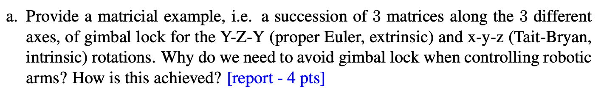
The basic 3D rotation matrices are:
$$
\begin{gathered}
R_x(\alpha)=\begin{bmatrix}1&0&0\\[2pt]0&\cos\alpha&-\sin\alpha\\[2pt]0&\sin\alpha&\cos\alpha\end{bmatrix},

R_y(\beta)=\begin{bmatrix}\cos\beta&0&\sin\beta\\[2pt]0&1&0\\[2pt]-\sin\beta&0&\cos\beta\end{bmatrix},

R_z(\gamma)=\begin{bmatrix}\cos\gamma&-\sin\gamma&0\\[2pt]\sin\gamma&\cos\gamma&0\\[2pt]0&0&1\end{bmatrix}.
\end{gathered}
$$
Hence we have:
### Y–Z–Y (Proper Euler, extrinsic)

For extrinsic composition, the three successive rotations are stacked by left-multiplication:
$$
R_{\text{YZY}}^{\text{(extrinsic)}}(\alpha,\beta,\gamma)=R_Y(\gamma)\,R_Z(\beta)\,R_Y(\alpha).
$$

As an example, when the middle angle satisfies $\beta = 0$ or $\pi$, we obtain

$$
R=R_Y(\gamma)\,I\,R_Y(\alpha)=R_Y(\alpha+\gamma)\quad(\beta=0),
$$
or
$$
R=R_Y(\gamma)\,R_Z(\pi)\,R_Y(\alpha)=R_Y(\gamma-\alpha)\,R_Z(\pi)
$$
which in essence also results in a loss of one degree of freedom.

In other words, infinitely many pairs $(\alpha,\gamma)$ produce the same overall rotation (it depends only on the sum $\alpha+\gamma$), so the effective number of independent parameters is reduced.


### X–Y–Z (Tait–Bryan, intrinsic)

Analogously, for intrinsic rotations we consider, for instance, the z–y–x sequence, and write the general form as:

$$
R_{\text{xyz}}^{\text{(intrinsic)}}(\alpha,\beta,\gamma)
=R_z(\alpha)\,R_y(\beta)\,R_x(\gamma).
$$

As an example, take the pitch angle $\beta = \dfrac{\pi}{2}$. Then

$$
R=R_z(\alpha)R_y\!\bigl(\tfrac{\pi}{2}\bigr)R_x(\gamma)
=\begin{bmatrix}
0&-\sin(\alpha-\gamma)&\cos(\alpha-\gamma)\\
0& \cos(\alpha-\gamma)&\sin(\alpha-\gamma)\\
-1&0&0
\end{bmatrix}.
$$

We see that the result depends only on the difference $\alpha-\gamma$; the yaw $\alpha$ and roll $\gamma$ are “locked” together. This is precisely the gimbal lock phenomenon for the intrinsic x–y–z parameterization at $\beta = \pm \dfrac{\pi}{2}$.


**Why gimbal lock should be avoided in robotic manipulator control**
- **Loss of degrees of freedom / parametric singularity**:  
  At a gimbal-lock configuration, the Euler-angle mapping is no longer a one-to-one parametrization of orientation; fine adjustments of the attitude become impossible or numerically unstable.

- **Jacobian singularity / unbounded joint velocities**:  
  When the angular velocity required by the orientation error is mapped into joint space, rank deficiency of the Jacobian at the singularity implies formally infinite joint velocities (numerical blow-up).

- **Control instability / chattering**:  
  Small changes in orientation may induce discontinuous jumps in the Euler-angle parameters (branch switching), leading to controller oscillations and infeasible or erratic motion paths.

- **Planning failures**:  
  Inverse kinematics may have multiple solutions or no solution at all near singularities, and the associated optimization problems become ill-conditioned, resulting in poor tracking accuracy or even non-convergence.

**How is it handled in practice (engineering remedies)?**
- **Avoid using Euler angles as internal state (use only for visualization)**:  
  Represent orientation with unit quaternions, axis–angle (exponential coordinates), or rotation matrices directly in the feedback loop, thereby avoiding parametrization singularities.

- **Singularity-robust inverse kinematics**:  
  Use damped least squares (DLS / Levenberg–Marquardt) or pseudo-inverses with singular-value thresholds to prevent the solution from blowing up when the Jacobian is near singular.

- **Redundancy and null-space avoidance strategies**:  
  For redundant manipulators, introduce cost functions in the Jacobian null space so that the joint configuration is actively driven away from singular manifolds (for example, keeping the wrist pitch away from $\pm 90^\circ$).

- **Path-/task-level constraints**:  
  During motion planning, explicitly incorporate singularity-avoidance terms together with joint limits and bounds on joint velocities/accelerations; when necessary, switch between multiple orientation charts (coordinate patches) to cover the configuration space.

- **Quaternion-based interpolation**:  
  Use SLERP or dual-quaternion interpolation for trajectory generation so that attitude transitions remain smooth and free of discontinuities.

## b: From a unit quaternion to its rotation matrix
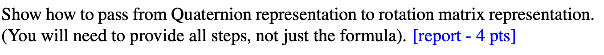
Let
$$
q=(w,\mathbf{v}), \mathbf{v=(x,y,z)^\top, ||q||=1\Rightarrow \mathbb{w}^2+||v||^2 = 1},
$$
We represent a 3D vector $\mathbf{p} \in \mathbb{R}^3$ as a pure quaternion $p_1 = (0, \mathbf{p})$. The rotation of $\mathbf{p}$ by the unit quaternion $\mathbf{q}$ is given by quaternion conjugation:

$$
p_2 = q\,p_1\,q^{-1},q^{-1} = \bar q = (w,-v),
$$
transfer quaternion multiplication to vector form
$$
(a,\mathbf{u})(b,\mathbf{v})=(ab-\mathbf{uv},a\mathbf{v}+b\mathbf{u}+\mathbf{u\times v}),
$$
get
$$
qp_1 = (w,\mathbf{v})(0,\mathbf{p}_1)=(-\mathbf{v}\cdot \mathbf{p_1},w\mathbf{p_1}+\mathbf{v}\times \mathbf{p_1}),
$$
set $s=-\mathbf{v}\cdot\mathbf{p}, \mathbf u=w\mathbf p+\mathbf v\times\mathbf p$. Now multiply by $\bar q = (w,-\mathbf{v})$, then
$$
p_2 = qp_1q^{-1} = (s,\mathbf{u})(w,-\mathbf{v}) = (sw+\mathbf{u\cdot v},-s\mathbf{v}+w\mathbf{u}-\mathbf{u\times v})
$$
We expect $p_2$ to be a pure quaternion (scalar part 0), because it represents a 3D vector after rotation. Check the scalar part:
$$
sw+\mathbf u\!\cdot\!\mathbf v
=(-\mathbf v\!\cdot\!\mathbf p)w+\big(w\mathbf p+\mathbf v\times\mathbf p\big)\!\cdot\!\mathbf v
=-w\,\mathbf v\!\cdot\!\mathbf p+w\,\mathbf p\!\cdot\!\mathbf v+0=0.
$$
For the $p_2$ vector part :
$$

\begin{aligned}
-s\,\mathbf v + w\mathbf u - \mathbf u\times\mathbf v
&= (\mathbf v\!\cdot\!\mathbf p)\mathbf v + w^2\mathbf p
   + 2w(\mathbf v\times\mathbf p)
   - \bigl(\|\mathbf v\|^2\mathbf p - (\mathbf v\!\cdot\!\mathbf p)\mathbf v\bigr)\\
&= (w^2 - \|\mathbf v\|^2)\mathbf p
   + 2(\mathbf v\!\cdot\!\mathbf p)\mathbf v
   + 2w(\mathbf v\times\mathbf p)
\end{aligned}
$$

set $\mathbf v=(q_x,q_y,q_z),\ w=q_w ,$ then
$$
[\mathbf v]_\times=\begin{bmatrix}
0&-q_z&q_y\\ q_z&0&-q_x\\ -q_y&q_x&0
\end{bmatrix}, [\mathbf v]_\times\mathbf p=\mathbf v\times\mathbf p,
$$
Also note the identity $[\mathbf v]_\times^2=\mathbf v\mathbf v^\top-(\mathbf v^\top\mathbf v)I$ get rotation matrix $R$,
$$
R=(w^2-\mathbf v^\top\mathbf v)\,I+2\,\mathbf v\mathbf v^\top+2w[\mathbf v]_\times,\\
\boxed{R=I+2w[\mathbf v]\times+2[\mathbf v]_\times^2},
$$

Expanding the expression entrywise, we obtain the standard explicit matrix form:

$$
\boxed{
R(q)=
\begin{bmatrix}
1-2(q_y^2+q_z^2) & 2(q_x q_y - q_z q_w) & 2(q_x q_z + q_y q_w)\\[2pt]
2(q_x q_y + q_z q_w) & 1-2(q_x^2+q_z^2) & 2(q_y q_z - q_x q_w)\\[2pt]
2(q_x q_z - q_y q_w) & 2(q_y q_z + q_x q_w) & 1-2(q_x^2+q_y^2)
\end{bmatrix}}
$$


## c: different rotation representations in four application scenarios
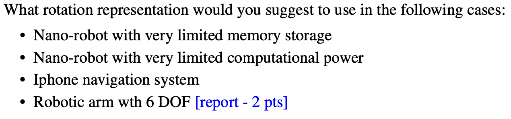


### Case 1: Nano-robots with very limited memory storage
- Choice: Axis–angle representation

  Reasoning:
Axis–angle needs only 3 independent parameters for a 3D rotation and does not suffer from gimbal lock. The trade-off is a discontinuity at 0/2\pi in the angle, but in practice this can be mitigated by using small incremental rotations and regular re-normalization.

### Case 2: Nano-robot with very limited computational power
- Choice: Rotation matrix

  Reasoning:
Applying a rotation to a vector is then just a linear operation (matrix–vector multiplication), with no need for evaluating trigonometric functions. Although a rotation matrix stores 9 parameters, it has the lowest CPU cost and the most straightforward implementation for repeatedly rotating vectors under severe compute constraints.
### Case 3: IPhone navigation system
- Choice: Quaternions for the internal state + Euler angles for UI display

  Reasoning:
Quaternions have no singularities or discontinuities, are numerically stable, and are convenient for filtering and interpolation in the internal estimation pipeline. For user-facing outputs, the orientation can be converted to yaw/pitch/roll (Euler angles), which are more intuitive to display to the user.

### Case 4:Robotic arm with 6 DOF
- Choice: Use rotation matrices (or full homogeneous transforms) to represent chained poses along the kinematic chain, and use quaternions or a Lie-algebra–based error such as R_d^\top R for attitude error in control/estimation,

  Reasoning:
  For a 6-DOF robotic arm, rotation matrices (or homogeneous transforms) are convenient for chaining poses along the kinematic chain by simple matrix multiplications. For control and estimation, quaternions or errors like R_d^\top R are preferred because they avoid Euler-angle singularities such as gimbal lock. 


# Q3
## a: Prove that $q$ and $-q$ are equivalent
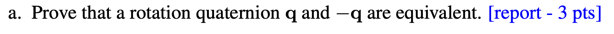

The mapping from an axis–angle representation $(\mathbf{u},\theta)$ to a unit quaternion is
$$
q \;=\; e^{\frac{\theta}{2}(u_x\mathbf i+u_y\mathbf j+u_z\mathbf k)}
= \cos(\frac{\theta}{2})\;+\;(u_x\mathbf i+u_y\mathbf j+u_z\mathbf k)\,\sin(\frac{\theta}{2}),
$$
where $\mathbf{u} = (u_x,u_y,u_z)$ is a unit rotation axis, and $q$ is a unit quaternion.

when $\theta = \theta+2\pi$, obtain:
$$
q’ = \cos\!\Big(\frac{\theta}{2}+\pi\Big)+\mathbf u\,\sin\!\Big(\frac{\theta}{2}+\pi\Big)
= -\cos\!\frac{\theta}{2}-\mathbf u\sin\!\frac{\theta}{2}=-q.
$$
Since the axis–angle pairs $(\mathbf{u},\theta)$ and $(\mathbf{u},\theta+2\pi)$ represent the same geometric rotation, the quaternions $q$ and $-q$ encode the same rotation.

Alternatively, we can use the quaternion rotation formula for a pure vector quaternion $\mathbf{p}$:

$$
\mathbf p’ \;=\; q\,\mathbf p\,q^{-1}.
$$
Then replace $q$ by $-q$:
$$
(-q)\,\mathbf p\,(-q)^{-1}=(-1)\,q\,\mathbf p\,(-1)\,q^{-1}=q\,\mathbf p\,q^{-1},
$$
because $(-q)^{-1} = -\,q^{-1}$ and the scalar $-1$ commutes with every quaternion. Hence $q$ and $-q$ induce exactly the same rotation.

## b: When do two 3D rotation matrices commute?


Let $\mathbf{R_a,R_b} \in \mathbf{SO(3)}$ be two arbitrary rotation matrices, and suppose
$$\mathbf{R_a R_b}=\mathbf{R_b R_a}$$


Represent the two rotations by unit quaternions $q_a=(w_a,\mathbf v_a), q_b=(w_b,\mathbf v_b)$, then
$$
w=\cos\!\frac{\theta}{2},\quad \mathbf v=\mathbf u\,\sin\!\frac{\theta}{2}.
$$
where $\mathbf{u}$ is the unit rotation axis and $\theta$ is the rotation angle.

The quaternion product corresponding to two successive rotations is
$$
q_1q_2=\Big(w_1w_2-\mathbf v_1\!\cdot\!\mathbf v_2,\;\; w_1\mathbf v_2+w_2\mathbf v_1+\mathbf v_1\times\mathbf v_2\Big).
$$

and “quaternion multiplication corresponds to applying the rotations in sequence.”From Question 3(a) we know that $$R(q) = R(-q)$$. Therefore,

$$
R_aR_b=R_bR_a \;\Longleftrightarrow\; R(q_aq_b)=R(q_bq_a)
\;\Longleftrightarrow\; q_aq_b=\pm\,q_bq_a,
$$
We now analyze these two cases.

- $q_aq_b=q_bq_a$ 

  Comparing the vector parts of the two products gives $\mathbf{v}_a \times \mathbf{v}_b = \mathbf{0}.$ Hence $\mathbf{v}_a$ and $\mathbf{v}_b$ are collinear, which means that the associated rotation axes are parallel or antiparallel (i.e., lie on the same geometric line), or that one of the vectors vanishes, i.e. $\sin(\theta/2)=0$, corresponding to the identity rotation.

  Thus **any two rotations about the same axis (including the identity) commute.**


- $q_aq_b=-\,q_bq_a$

    Equating scalar and vector parts yields
  $$
  \begin{cases}
  w_aw_b=\mathbf v_a\!\cdot\!\mathbf v_b,\\[4pt]
  w_a\mathbf v_b+w_b\mathbf v_a=\mathbf 0.
  \end{cases}
  $$
  Substituting $w=\cos\frac{\theta}{2},\ \mathbf v=\mathbf u\sin\frac{\theta}{2}, $ and taking the dot product of the second equation with $\mathbf u_a,\mathbf u_b $, respectively, we can deduce that either there is an identity rotation, or $\cos\frac{\theta_a}{2}=\cos\frac{\theta_b}{2}=0\Rightarrow \theta_a=\theta_b=\pi$. From the first equation we then obtain $\mathbf{u}_a!\cdot!\mathbf{u}_b=0$.
Therefore, the exceptional case is: both rotations are by $180^\circ$ and their axes are mutually orthogonal.

### Summary

Two 3D rotation matrices $R_a,R_b \in \mathrm{SO}(3)$ commute **if and only if** one of the following holds:

1. They are rotations about the same axis (any angles, including the identity rotation);  
2. Both are $180^\circ$ rotations, and their rotation axes are orthogonal.


# Q4
## a: Convert the quaternion to Z–Y–X (Tait–Bryan) Euler angles.
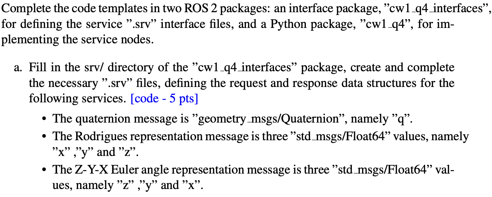
Complete the code according to the problem description.

## b:
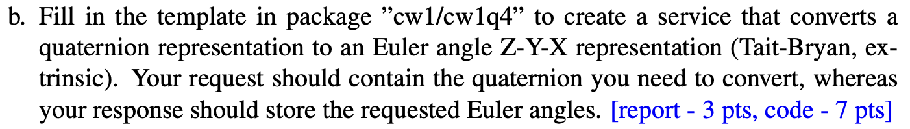
This task implements a ROS2 service that converts a quaternion into Euler angles in Z–Y–X (Tait–Bryan) order.
In the service callback, the input quaternion is first normalized. Then the Euler angles are computed using standard conversion formulas:

```python
# Z-Y-X (yaw-pitch-roll)
# roll (x)
roll = np.arctan2(2.0 * (w * x + y * z), 1.0 - 2.0 * (x * x + y * y))
# pitch (y)
s = np.clip(2.0 * (w * y - z * x), -1.0, 1.0)
pitch = np.arcsin(s)
# yaw (z)
yaw = np.arctan2(2.0 * (w * z + x * y), 1.0 - 2.0 * (y * y + z * z))
```
The results (in radians) are stored in the response fields:
```
response.z.data = float(yaw)
response.y.data = float(pitch)
response.x.data = float(roll)
```
The following is a test of the method: 
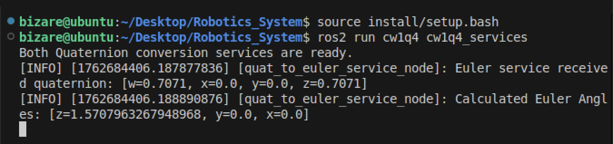
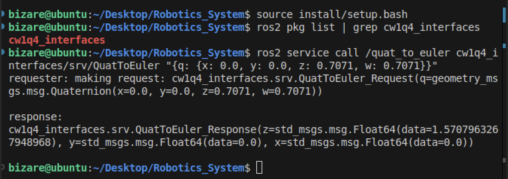
*Figure 1&2: The service node is launched and tested using the input quaternion (x=0, y=0, z=0.7071, w=0.7071).
The response correctly returns the Euler angles (z=1.5707, y=0, x=0), which corresponds to a 90° rotation around the Z-axis.*

The test results confirm that the service works correctly and the implementation is valid.

## c:
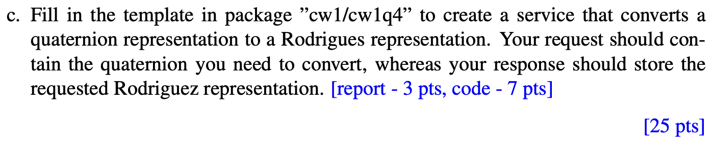
In this task, the function `QuatToRodriguesService` is implemented to create a ROS2 service `node/quat_to_rodrigues`,
which receives an input quaternion and outputs the corresponding Rodrigues vector representation.

The service request contains a quaternion (x, y, z, w), and the service response returns the calculated Rodrigues parameters (x, y, z).

In the implementation, the input quaternion is first normalized to avoid numerical errors.
Then the rotation angle θ and rotation axis r are computed using the following equations:

$$
\theta = 2 \arccos(w), \quad
r = \frac{[x, y, z]}{\sin(\theta/2)},
$$
The Rodrigues vector is then obtained as:
$$
\mathbf{Rodrigues} = \theta \, r =
\frac{2[x, y, z]}{\sin(\theta/2)} \arccos(w)
$$
The computed components are stored in
```
response.x.data = float(r_vec[0])
response.y.data = float(r_vec[1])
response.z.data = float(r_vec[2])
```
The following is a test of the method: 
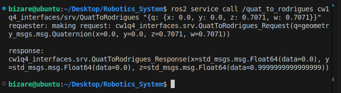
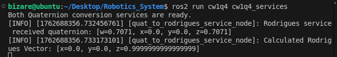
Figure 3 & 4: The service node `/quat_to_rodrigues` is launched and tested using the input quaternion (x=0, y=0, z=0.7071, w=0.7071). The response correctly returns the Rodrigues vector (z=1.0, y=0, x=0), which represents a $90°$ rotation around the Z-axis.

Overall, the QuatToRodriguesService successfully implements the quaternion-to-Rodrigues conversion.
The /quat_to_rodrigues service functions properly and returns accurate results consistent with the mathematical model.
# Q5
## a
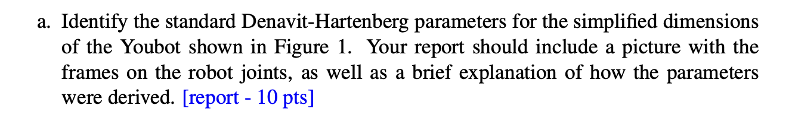

DH Coordinate Frame Setup:

1. The base frame 0 is placed on the robot’s base, with the $z_0$-axis pointing vertically upward along the rotation axis of the first joint (A1).
2. For each joint $i$, define the $z_i$-axis along the joint’s axis of rotation.
3. The $x_i$-axis is defined as the common normal direction—that is, the shortest line connecting $z_{i-1}$ and $z_i$, pointing from $z_{i-1}$ toward $z_i$. *Note:* For this youBot arm picture, frames 3 and 4 **share the same origin** since their joint axes intersect at one point.

4. The $y_i$-axis is determined by the right-hand rule, ensuring that ($x_i$, $y_i$, $z_i$) form a right-handed coordinate system.
5. In each coordinate frame, record the link length ($a_i$), link twist ($α_i$), link offset ($d_i$), and joint angle ($\theta_i$) between adjacent joints to obtain the complete DH parameter table.

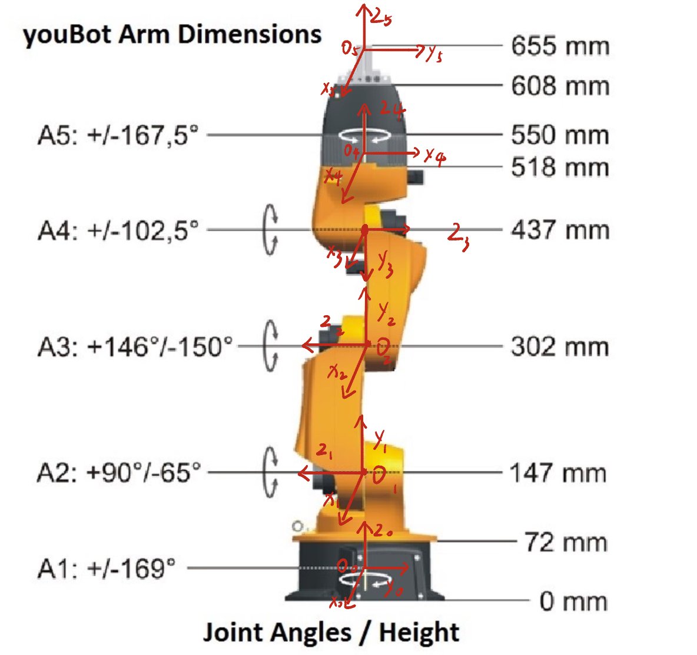 

### Table 1. Standard Denavit–Hartenberg Parameters for the KUKA youBot Arm

| Joint (i) | θᵢ *(Joint Angle)* | dᵢ *(mm)* | aᵢ *(mm)* | αᵢ *(rad)* 
|:---------:|:------------------:|:---------:|:---------:|:------------:
| 1         | $\theta_1$         | 147       | 0         | $+\pi/2$ 
| 2         | $\theta_2 + \pi/2$ | 0         | 155       | 0 
| 3         | $\theta_3$         | 0         | 135       | 0 
| 4         | $\theta_4-\pi/2$   | 0         | 0         | $-\pi/2$ 
| 5         | $\theta_5$         | 218       | 0         | 0 

## b
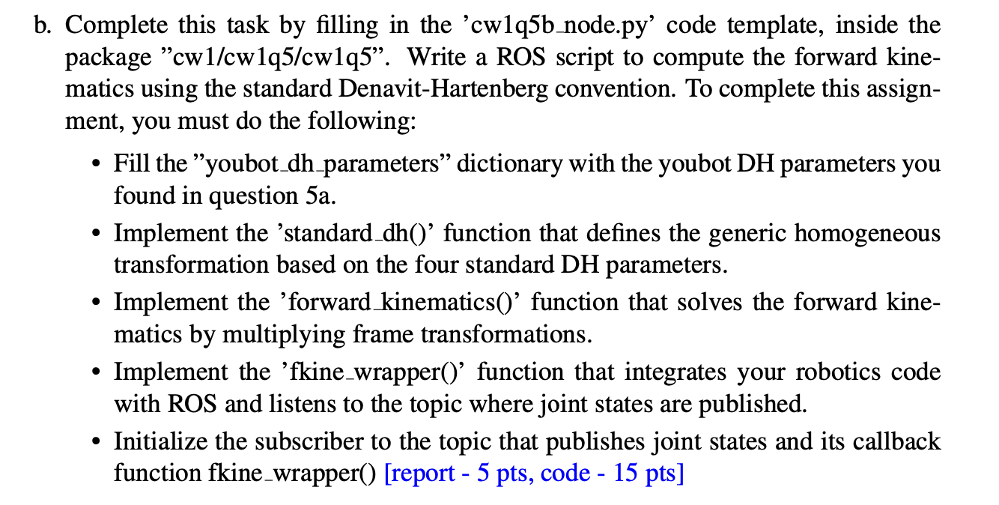
### Task 1: Define the DH Table Based on Question 5a
```python
youbot_dh_parameters = {
  'a':[0, 0.155, 0.135, 0, 0],
  'alpha':[np.pi/2, 0, 0, -np.pi/2, 0],
  'd' : [0.147, 0, 0, 0, 0.218],
  'theta':[0, np.pi/2, 0, -np.pi/2, 0]
  }
``` 
The DH parameters obtained in Question 5a were filled into the dictionary above, representing the link lengths, twists, offsets, and joint angles of the YouBot manipulator.
### Task 2: Implementing the Standard DH Transformation
According to the standard DH formulation,
$$
{}^{i-1}T_i =
\begin{bmatrix}
\cos\theta_i & -\sin\theta_i\cos\alpha_i & \sin\theta_i\sin\alpha_i & a_i\cos\theta_i &\\
 \sin\theta_i & \cos\theta_i\cos\alpha_i & -\cos\theta_i\sin\alpha_i & a_i\sin\theta_i \\
0 & \sin\alpha_i & \cos\alpha_i & d_i \\
0 & 0 & 0 & 1
\end{bmatrix}
$$
where:
- $a_i$: link length
- $\alpha_i$: link twist
- $d_i$: link offset 
- $\theta_i$: joint angle

Therefore, the equation is
```python
    A = np.array([
      [np.cos(theta), -np.sin(theta)*np.cos(alpha), np.sin(theta)*np.sin(alpha), a*np.cos(theta)],
      [np.sin(theta), np.cos(theta)*np.cos(alpha), -np.cos(theta)*np.sin(alpha), a*np.sin(theta)],
      [0.0, np.sin(alpha), np.cos(alpha),d],
      [0.0, 0.0, 0.0, 1.0 ]
      ])
```
### Task 3: Implementing the Forward Kinematics Calculation
Based on the forward kinematics principle, the overall transformation from the base frame to the end-effector frame is obtained by multiplying the individual joint transformation matrices:
$$
{}^0T_n = {}^0T_1 \cdot {}^1T_2 \cdot {}^2T_3 \cdot \ldots \cdot {}^{n-1}T_n
$$
or equivalently,
$$
T = \prod_{i=1}^{n} {}^{i-1}T_i
$$
The implementation in code is:
```python
for i in range(up_to_joint):
  a = dh_dict['a'][i]
  alpha = dh_dict['alpha'][i]
  d = dh_dict['d'][i]
  theta = dh_dict['theta'][i] + joints_readings[i]

  T_i = standard_dh(a, alpha, d, theta)
  T = np.dot(T, T_i)
```

urdf robotics description

### Task 4: Implementing the fkine_wrapper() Function
This function serves as the ROS 2 subscriber callback, connecting the mathematical forward-kinematics computation with the ROS communication system.
It listens to the topic `/joint_states`, extracts the joint angle values, computes the end-effector pose using the previously defined `forward_kinematics()` function, converts the rotation matrix to a quaternion, and publishes the result as a TF transform.

The callback performs the following steps:
```
  joints = list(joint_msg.position)

  T = forward_kinematics(youbot_dh_parameters, joints)

  R = T[:3, :3]
  q = rotmat2q(R)

  t = TransformStamped()
  t.header.stamp = self.get_clock().now().to_msg()
  t.header.frame_id = 'base_link'
  t.child_frame_id = 'end_effector'

  t.transform.translation.x = float(T[0, 3])
  t.transform.translation.y = float(T[1, 3])
  t.transform.translation.z = float(T[2, 3])
  t.transform.rotation = q

  self.br.sendTransform(t)
  self.get_logger().info(f"End-effector pose: x={T[0,3]:.3f}, y={T[1,3]:.3f}, z={T[2,3]:.3f}")
```
### Task 5: Node Initialization and ROS 2 Integration

The purpose of this task is to integrate the forward kinematics algorithm within the ROS 2 framework, allowing the node to receive live joint states and compute the corresponding end-effector pose in real time.
Since the `ForwardKinematicsNode` class was already defined in the source code, it can be executed directly using the following commands:

```bash
colcon build
source install/setup.bash
ros2 run cw1q5 cw1q5b_node
```
To test the node, publish a sample joint state message:
```bash
source install/setup.bash
rostopic pub /joint_states sensor_msgs/msg/JointState "{name: ['joint1','joint2','joint3','joint4','joint5'], position: [0.0, 0.0, 0.0, 0.0, 0.0]}"
```
Then launch RViz for visualization:
```
source install/setup.bash
rviz2
```
In RViz, set the Fixed Frame to base_link and enable TF display.
When all joint angles are zero, all coordinate frames appear stacked along the z-axis, confirming the correctness of the forward kinematics computation.

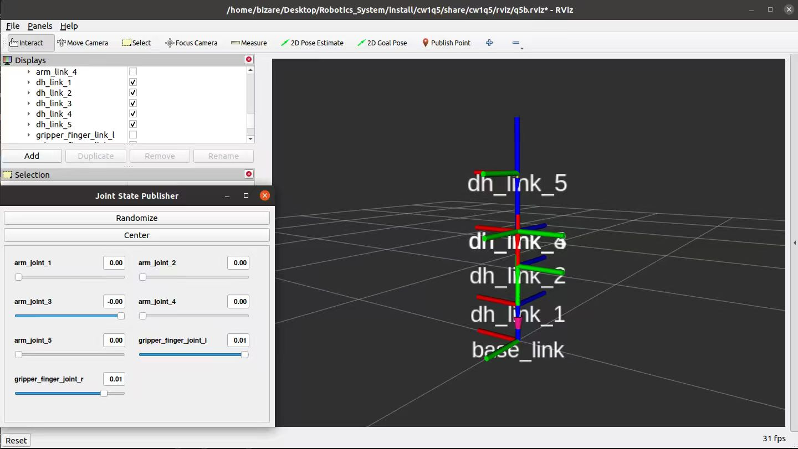

### Summary

This task successfully integrates the forward kinematics computation with the ROS 2 environment.
The node subscribes to /joint_states, computes transformations, and publishes them as TF frames.
RViz visualization confirms that the implementation is correct and functions as expected.


## c: Derivation of Standard DH Parameters from the URDF Model
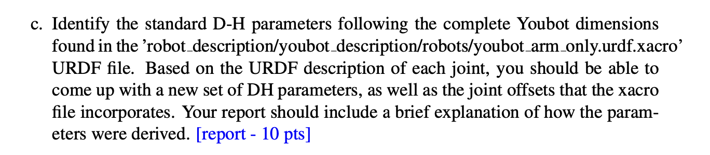

在`robot_description/youbot_description/robots/youbot_arm_only.urdf.xacro`并没有直接描述arm的相关信息，而是作为top-level file，其中以下代码定义了机械臂模块同时包含一个bias
```xml
  <!-- youbot arm -->
  <xacro:include filename="$(find youbot_description)/urdf/youbot_arm/arm.urdf.xacro" />

  ...

    <xacro:youbot_arm name="$(arg robot_name)" parent="base_link">
    <origin xyz="-0.024 0 0.030" rpy="0 0 0" />
  </xacro:youbot_arm>
```
其中`urdf/youbot_arm/arm.urdf.xacro`定义了关键的信息在`youbot_arm`模块中，如下
```xml
<xacro:macro name="youbot_arm" params="parent name *origin">

		<!-- joint between base_link and arm_0_link -->
		<joint name="${name}_joint_0" type="fixed" >
			<xacro:insert_block name="origin" />
			<parent link="${parent}" />
			<child link="${name}_link_0" />
			
		</joint>

  ...

</xacro:macro>
```

基于可以得到以下信息

|   Axis (x,y,z)   |   Original (x,y,z)  |   RPY (x,y,z)     |
|:----------------:|:-------------------:|:-----------------:|
|      0, 0, -1    |   0.024, 0, 0.096   |   0, 0     , 170  |
|      0, 1, 0     |   0.033, 0, 0.019   |   0, -65   , 0    |
|      0, 1, 0     |   0,     0, 0.155   |   0, 146   , 0    |
|      0, 1, 0.    |   0,     0, 0.135   |   0, -102.5, 0    |
|      0, 0, -1    |  -0.002, 0, 0.130   |   0, 0     , 167.5|


在 URDF 中，axis 表示关节在 joint 坐标系中的旋转轴，因此在分析关节运动方向时，需要结合 joint frame 的实际方向进行判断。origin 则定义了 joint 坐标系相对于父坐标系的固定变换，包括平移 xyz 与绕父坐标系的 RPY 旋转。

标准 DH 参数采用如下固定变换顺序：
$$
T_i^{i+1}=R_z(\theta)\;T_z(d)\;T_x(a)\;R_x(\alpha),
$$
而 URDF 的 <origin> 使用的顺序为：
$$
T = \text{Trans}(xyz)\;R_z(yaw)\;R_y(pitch)\;R_x(roll).
$$
由于两者的计算顺序不同，因此无法将 URDF 中的平移或旋转项直接对应为 DH 参数（例如不能直接把 origin 的 z 平移当作 DH 中的 d）。必须根据坐标系的相对方向和姿态进行几何分析后，才能正确确定 DH 变量。

综上所述，根据上述宏中定义的内容可以得到 DH-table 为：


| Joint (i) |  θᵢ *(Joint Angle)*  | dᵢ *(m)* | aᵢ *(m)* | αᵢ *(rad)* 
|:---------:|:--------------------:|:---------:|:---------:|:------------:
| 1         | $\theta_1 $        | 0.147     | 0.033     | $+\pi/2$ 
| 2         | $\theta_2 + \pi/2$ | 0.019     | 0.155     | 0 
| 3         | $\theta_3$         | 0         | 0.135     | 0 
| 4         | $\theta_4-\pi/2$   | 0         | 0         | $-\pi/2$ 
| 5         | $\theta_5$         | 0.185     | -0.002    | 0 

同时可知joint offsets和joint readings polarity为

| Joint (i) |  offset  | joint readings polarity
|:---------:|:--------------------:|:---------:
| 1         | $170^\circ$      | -1    
| 2         | $-65^\circ$     | 1   
| 3         | $146^\circ$      | 1        
| 4         | $-102.5^\circ$   | 1         
| 5         | $167.5^\circ$    | -1    

综上所述

| Joint (i) |  θᵢ *(Joint Angle)*  | dᵢ *(m)*  | aᵢ *(m)*  | αᵢ *(rad)* 
|:---------:|:--------------------:|:---------:|:---------:|:------------:
| 1         |$\theta_1 + 170^\circ$| 0.147     | 0.033     | $+\pi/2$ 
| 2         |$\theta_2 +25^\circ$  | 0.019     | 0.155     | 0 
| 3         |$\theta_3+ 146^\circ$ | 0         | 0.135     | 0 
| 4         |$\theta_4-192.5^\circ$| 0         | 0         | $-\pi/2$ 
| 5         |$\theta_5+167.5^\circ$| 0.185     | -0.002    | 0 

## d
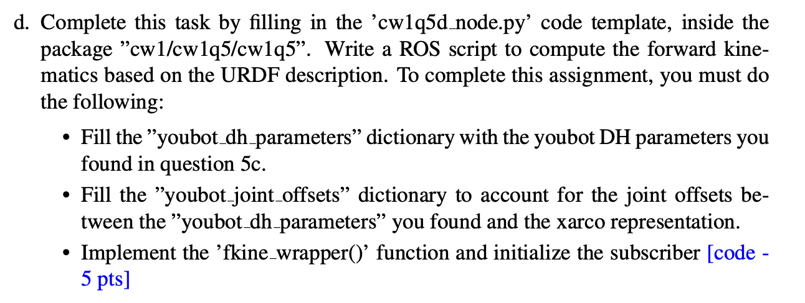
code部分如`cw1q5/cw1q5d.py`部分所示，运行结果如下

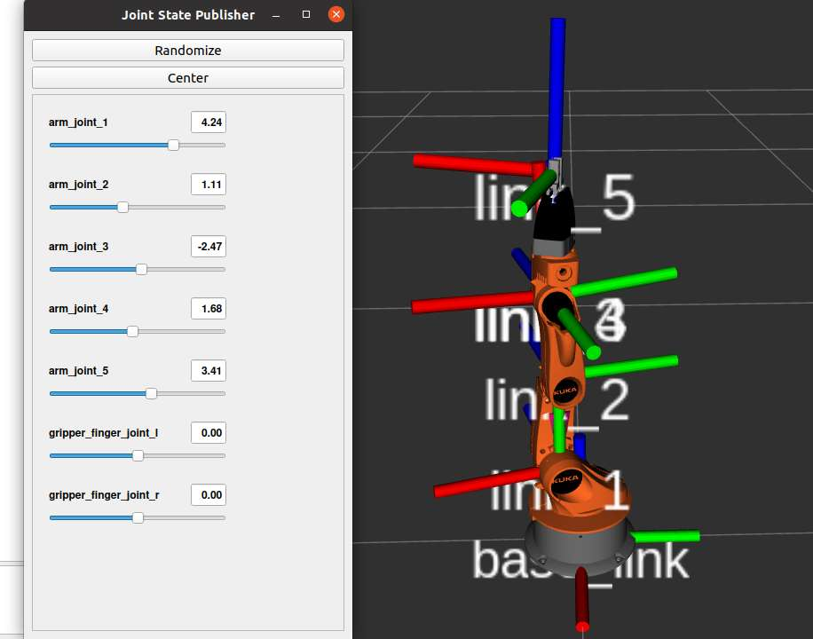
如图所示，当前结果于urdf预设模型高度重合，结果无误

# q6
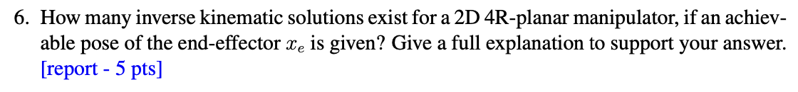
对于一个 2D 平面上的 4 旋转关节机械臂（4R planar manipulator），当末端执行器 给定一个可达的位置与姿态 x_e 时，它的逆运动学（IK）一共有多少个解？并要求你解释为什么会有这些解。

设4R 平面机械臂的末端姿态为：
$$
x_e = (x, y, \phi)^T
$$
关节角为：
$$
\theta = (\theta_1,\theta_2,\theta_3,\theta_4)^T.
$$
末端速度与关节速度间满足：
$$
\dot{x}_e = J(\theta)\dot{\theta},
$$
其中 Jacobian 为：
$$
J(\theta) \in \mathbb{R}^{3\times 4}.
$$

在非奇异配置下，由于映射 4 维关节速度到 3 维末端速度，Jacobian 满秩,存在：$$\operatorname{rank}(J)=3.$$


根据秩–零度定理（Rank–Nullity Theorem）：
$$
\dim(\mathrm{Null}(J)) = 4 - \operatorname{rank}(J)
= 4-3 = 1.
$$

因此存在非零向量 $v\neq 0$ 使：
$$
J(\theta)v = 0.
$$

将：
$$
\dot{\theta} = \alpha(t)\, v, \qquad (\alpha(t) \in \mathbb{R})
$$
代入速度方程得到：
$$
\dot{x}_e = J \dot{\theta} = J (\alpha v) = \alpha\, Jv = 0.
$$
因此：
$$
\dot{x}_e = 0 \quad\Rightarrow\quad x_e = \text{a}.
$$
where: 
a是一个常数

即末端位置与姿态保持不动。

因为末端姿态不变，所以所有满足
$$
\dot{\theta}(t)=\alpha(t)v
$$
的关节轨迹都满足
$$
f(\theta(t)) = x_e.
$$
积分得到：
$$
\theta(t) = \theta_0 + \int_0^t \alpha(\tau)v\,d\tau.
$$
这是一条 1 维连续曲线。包含无限多个点。故IK 解是无限个


# q7


假设机器人在自由空间中运动（即没有障碍物），并且对于给定的末端执行器姿态 x_e 存在多个逆运动学解，那么在选择一个最优解时应考虑哪些准则？”


1. 关节极限（Joint Limits）最小化

优先选择远离关节角度极限的解，使关节角 \theta_i 尽可能处于其运动范围的中间区域。
数学上可最小化：
\sum_i (\theta_i - \theta_{i,\mathrm{mid}})^2

2. 最小关节移动量（Minimum Joint Motion）

若已知当前关节角为 \theta_{\mathrm{cur}}，可选择使关节变化量最小的解：
\min_{\theta} \|\theta - \theta_{\mathrm{cur}}\|

3. 远离奇异位形（Avoid Singularities）

避免选择使雅可比矩阵接近奇异的解（\det(JJ^T) 很小）。
可最小化：
\frac{1}{\det(JJ^T)}

4. 操作性能指标（Manipulability）最大化

选择能够提供更好操作能力（manipulability）的解。
常用 Yoshikawa 指标：
w = \sqrt{\det(JJ^T)}

5. 连续性与可预测性（Continuity / Smoothness）

轨迹规划中优先选择与前一时刻解连续的逆解，避免“突然跳变”，例如肘形态突然翻转。


在自由空间中从多个逆运动学解选择最优解时，应综合考虑以下准则：远离关节极限、最小关节变化量、避免奇异位形、最大操控性能、能量与力矩最小化、以及关节空间的连续性。这些准则有助于提高机械臂的稳定性、安全性、效率和控制性能。

# q8
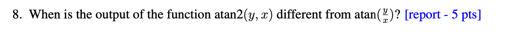


在什么情况下函数 atan2(y, x) 的输出会不同于函数 atan(y/x) 的输出？”


1. 输入点处于不同象限时（核心原因）

原因：atan(y/x) 无法区分象限，而 atan2(y, x) 可以。
	•	atan(y/x) 仅根据比值 y/x 决定角度，得到的角度范围是
(-\pi/2, \pi/2)
因此无法判断点 (x, y) 位于第二象限还是第一象限，也无法区分第三与第四象限。
	•	atan2(y, x) 根据 x 与 y 的符号确定正确象限，输出范围为
(-\pi, \pi]

因此，当 x < 0（第二或第三象限）时，两者一定不同。

例如：
(x, y)=(-1, 1)
\text{atan}(y/x) = \text{atan}(-1) = -\frac{\pi}{4}
但真正角度应在第二象限：
\text{atan2}(1, -1) = \frac{3\pi}{4}

两者相差整整 \pi。

⸻

2. 当 x = 0 时（除零问题）

原因：atan(y/x) 未定义，而 atan2(y, 0) 有明确结果。
	•	若 x = 0，则 y/x 不存在（除以零）。
	•	atan2 正确处理：
\text{atan2}(y,0)=
\begin{cases}
+\frac{\pi}{2}, & y>0\\[4pt]
-\frac{\pi}{2}, & y<0
\end{cases}

因此在 x = 0 的所有情况下，两者也不同。

⸻

最终总结（适合写在报告里的句子）

atan2(y, x) 与 atan(y/x) 的输出不同主要发生在两种情况：其一是当点 (x, y) 位于第二或第三象限（即 x < 0）时，因为 atan(y/x) 无法区分象限；其二是当 x = 0 时，atan(y/x) 不定义，而 atan2(y, x) 能给出正确的角度。因此，只要需要区分象限或避免除零问题，都必须使用 atan2。

# q9
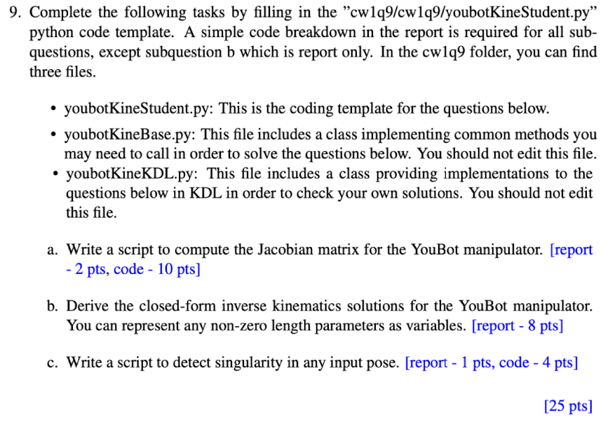