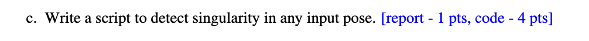

# Q1
## a: Prove that every element of the rotation matrix is less than or equal to 1


Let $ \R\in\mathrm{SO}(3) $ be a rotation matrix. Then
$$
R^\top R = I.
$$
which implies that the columns (and, equivalently, the rows) of $R$ are orthonormal.

Write the $j$-th column of $R$ as $\mathbf{c}_j = (r_{1j}, r_{2j}, r_{3j})^\top$. From $R^\top R = I$ it follows that

$$
\mathbf{c}_j^\top\mathbf{c}_j= \sum_{i=1}^3 r_{ij}^2 = 1.
$$

so each column is a unit vector in $R^3$.

Since the sum of the three nonnegative numbers $r_{1j}^2, r_{2j}^2, r_{3j}^2$ equals $1$, each of them satisfies $r_{ij}^2 \le 1$. Hence, for all $i,j \in \{1,2,3\}$,
$$
|r_{ij}| \le 1.
$$
Therefore, every entry of a $3\times 3$ rotation matrix has absolute value at most $1$.


## b: Prove $R_{\mathbf{u},\theta}=R_{-\mathbf{u},-\theta}$


By Rodrigues’ rotation formula, the rotation matrix is
$$
R(\mathbf{u},\theta) \;=\; I + \sin\theta\, [\mathbf{u}]_\times + (1-\cos\theta)\,[\mathbf{u}]_\times^2,
$$
where $\mathbf{u}$ is a unit axis, $\theta$ is the rotation angle, and $[\mathbf{u}]_\times$ denotes the skew-symmetric matrix associated with $\mathbf{u}$.

Then, from the properties of skew-symmetric matrices and trigonometric functions,
$$
[-\mathbf{u}]_\times = -[\mathbf{u}]_\times,\quad [-\mathbf{u}]_\times^2 = [\mathbf{u}]_\times^2,\\ \sin(-\theta)=-\sin\theta,\quad \cos(-\theta)=\cos\theta,
$$
Substituting into $R(\mathbf{u},\theta)$ yields

$$
\begin{aligned}
R(-\mathbf{u},-\theta)
&= I + \sin(-\theta)\,[-\mathbf{u}]_\times + (1-\cos(-\theta))[-\mathbf{u}]_\times^2 \\
&= I + (-\sin\theta)(- [\mathbf{u}]_\times) + (1-\cos\theta)[\mathbf{u}]_\times^2 \\
&= I + \sin\theta\, [\mathbf{u}]_\times + (1-\cos\theta)[\mathbf{u}]_\times^2 \\
&= R(\mathbf{u},\theta).
\end{aligned}
$$

Therefore, $R_{\mathbf{u},\theta}=R_{-\mathbf{u},-\theta}$ for any unit axis $\mathbf{u}$.

## c: In coordinate frames $(a,b)$, what does each row of the matrix $^{a}\!R_b$ represent?


The rotation matrix $^{a}\!R_b$ converts the coordinate representation of the same geometric vector between frames:

$$
\mathbf{v}_a = {}^{a}\!R_b\, \mathbf{v}_b .
$$

Here $\mathbf{v}$ denotes a single geometric vector in space, while $\mathbf{v}_a$ and $\mathbf{v}_b$ are its coordinate column vectors in frames $a$ and $b$, respectively. The three columns of $^{a}\!R_b$ are exactly the coordinates, expressed in frame $a$, of the unit basis axes of frame $b$, namely $(\hat{\mathbf{x}}_b,\hat{\mathbf{y}}_b,\hat{\mathbf{z}}_b)$; the $j$-th column gives the components of $\hat{\mathbf{e}}_{b,j}$ in frame $a$.

Since
$$
({}^{a}\!R_b)^\top = {}^{b}\!R_a,
$$
and the columns of $^{b}\!R_a$ are the axes of frame $a$ expressed in frame $b$, it follows that the $i$-th **row** of $^{a}\!R_b$ is the coordinate row vector of the $i$-th unit axis of frame $a$ expressed in frame $b$.

Equivalently,

$$({}^{a}\!R_b)_{ij} = \hat{e}_{a,i} \cdot \hat{e}_{b,j},$$

Thus, $^{a}\!R_b$ collects the axes of frame $b$ in the coordinates of frame $a$ (by columns), while each row of $^{a}\!R_b$ lists the coordinates of the axes of frame $a$ in frame $b$.

## d: Derivations of relationships for rotation matrices


Let $\mathbf{R}\in \mathrm{SO}(3)$ denote a rotation in three dimensions. Write the rotation angle as $\theta$ and the rotation axis as $\mathbf{u}\in\mathbb{R}^3$ with $\|\mathbf{u}\|=1$, and let $[\mathbf{u}]_\times$ be the skew-symmetric matrix associated with $\mathbf{u}$.

By Rodrigues’ formula,
$$
R(\mathbf{u},\theta) \;=\; I + \sin\theta\, [\mathbf{u}]_\times + (1-\cos\theta)\,[\mathbf{u}]_\times^2,
$$

For any vector $\mathbf{x}$, using the vector triple-product identity and $\|\mathbf{u}\|=1$,
$$
\mathbf{[u]_\times^2x=u\times(u\times x)}=\mathbf{u(u^\top x)-x(u^\top u)}
$$
and, in particular, the skew-symmetric matrix satisfies
$$
[\mathbf{u}]_\times \mathbf{u} = \mathbf{u}\times \mathbf{u} = 0, [\mathbf{u}]_\times^2 = \mathbf{u}\mathbf{u}^\top-\mathbf{I}
$$

Substituting these into Rodrigues’ formula and multiplying both sides by $\mathbf{u}$ gives

$$
\begin{aligned}
R(\mathbf{u},\theta)\mathbf{u}&= \mathbf{u} + \sin\theta\,(\mathbf{[u]_\times}\mathbf{u}) + (1-\cos\theta)\,\mathbf{u}(\mathbf{u}^\top\mathbf{u}) \\
&= \mathbf{u} + \sin\theta*\mathbf{0} + (1-\cos\theta)\,\mathbf{u} \\
&= \mathbf{u}.
\end{aligned}
$$

Hence, the rotation axis $\mathbf{u}$ is an eigenvector of $R(\mathbf{u},\theta)$ with eigenvalue $1$; i.e., the axis direction is invariant under the rotation.

For any real orthogonal matrix in $\mathrm{SO}(3)$, the spectrum is $\{1,e^{i\theta},e^{-i\theta}\}$, so all eigenvalues have unit modulus. Consequently,

$$
\operatorname{tr}(R)=\lambda_1+\lambda_2+\lambda_3=1+2\cos\theta
\quad\Rightarrow\quad
\boxed{\;\theta=\arccos\!\Big(\frac{\operatorname{tr}(R)-1}{2}\Big).}
$$

When $\sin\theta\neq 0$ (equivalently, $\theta\notin\{0,\pi\}$), the rotation axis can be recovered from the skew-symmetric part of $R$:

$$
\boxed{
\mathbf{u} = \frac{1}{2\sin\theta}
\begin{bmatrix}
R_{32} - R_{23} \\[2pt]
R_{13} - R_{31} \\[2pt]
R_{21} - R_{12}
\end{bmatrix},\quad \theta \notin \{0,\pi\}.
}
$$

In the remaining cases $\theta\in\{0,\pi\}$:

- $\theta=0$: $R=I$, and the axis is arbitrary (undefined).
- $\theta=\pi$: using $R = -I + 2\,\mathbf{u}\mathbf{u}^\top$ we have

$$
R+I = 2\,\mathbf{u}\mathbf{u}^\top \ (\mathrm{rank}=1),
$$

so one may take $\mathbf{u}\propto$ any nonzero column (or row) of $(R+I)_{:j}$ and then normalize; the axis is determined only up to sign $\pm\mathbf{u}$.

# Q2

## a: provide a example

The basic 3D rotation matrices are:
$$
\begin{gathered}
R_x(\alpha)=\begin{bmatrix}1&0&0\\[2pt]0&\cos\alpha&-\sin\alpha\\[2pt]0&\sin\alpha&\cos\alpha\end{bmatrix},\\

R_y(\beta)=\begin{bmatrix}\cos\beta&0&\sin\beta\\[2pt]0&1&0\\[2pt]-\sin\beta&0&\cos\beta\end{bmatrix},\\

R_z(\gamma)=\begin{bmatrix}\cos\gamma&-\sin\gamma&0\\[2pt]\sin\gamma&\cos\gamma&0\\[2pt]0&0&1\end{bmatrix}.
\end{gathered}
$$
Hence we have:
### Y–Z–Y (Proper Euler, extrinsic)

For extrinsic composition, the three successive rotations are stacked by left-multiplication:
$$
R_{\text{YZY}}^{\text{(extrinsic)}}(\alpha,\beta,\gamma)=R_Y(\gamma)\,R_Z(\beta)\,R_Y(\alpha).
$$

As an example, when the middle angle satisfies $\beta = 0$ or $\pi$, we obtain

$$
R=R_Y(\gamma)\,I\,R_Y(\alpha)=R_Y(\alpha+\gamma)\quad(\beta=0),
$$
or
$$
R=R_Y(\gamma)\,R_Z(\pi)\,R_Y(\alpha)=R_Y(\gamma-\alpha)\,R_Z(\pi)
$$
which in essence also results in a loss of one degree of freedom.

In other words, infinitely many pairs $(\alpha,\gamma)$ produce the same overall rotation (it depends only on the sum $\alpha+\gamma$), so the effective number of independent parameters is reduced.


### X–Y–Z (Tait–Bryan, intrinsic)

Analogously, for intrinsic rotations we consider, for instance, the z–y–x sequence, and write the general form as:

$$
R_{\text{xyz}}^{\text{(intrinsic)}}(\alpha,\beta,\gamma)
=R_z(\alpha)\,R_y(\beta)\,R_x(\gamma).
$$

As an example, take the pitch angle $\beta = \dfrac{\pi}{2}$. Then

$$
R=R_z(\alpha)R_y\!\bigl(\tfrac{\pi}{2}\bigr)R_x(\gamma)
=\begin{bmatrix}
0&-\sin(\alpha-\gamma)&\cos(\alpha-\gamma)\\
0& \cos(\alpha-\gamma)&\sin(\alpha-\gamma)\\
-1&0&0
\end{bmatrix}.
$$

We see that the result depends only on the difference $\alpha-\gamma$; the yaw $\alpha$ and roll $\gamma$ are “locked” together. This is precisely the gimbal lock phenomenon for the intrinsic x–y–z parameterization at $\beta = \pm \dfrac{\pi}{2}$.


**Why gimbal lock should be avoided in robotic manipulator control**
- **Loss of degrees of freedom / parametric singularity**:  
  At a gimbal-lock configuration, the Euler-angle mapping is no longer a one-to-one parametrization of orientation; fine adjustments of the attitude become impossible or numerically unstable.

- **Jacobian singularity / unbounded joint velocities**:  
  When the angular velocity required by the orientation error is mapped into joint space, rank deficiency of the Jacobian at the singularity implies formally infinite joint velocities (numerical blow-up).

- **Control instability / chattering**:  
  Small changes in orientation may induce discontinuous jumps in the Euler-angle parameters (branch switching), leading to controller oscillations and infeasible or erratic motion paths.

- **Planning failures**:  
  Inverse kinematics may have multiple solutions or no solution at all near singularities, and the associated optimization problems become ill-conditioned, resulting in poor tracking accuracy or even non-convergence.

**How is it handled in practice (engineering remedies)?**
- **Avoid using Euler angles as internal state (use only for visualization)**:  
  Represent orientation with unit quaternions, axis–angle (exponential coordinates), or rotation matrices directly in the feedback loop, thereby avoiding parametrization singularities.

- **Singularity-robust inverse kinematics**:  
  Use damped least squares (DLS / Levenberg–Marquardt) or pseudo-inverses with singular-value thresholds to prevent the solution from blowing up when the Jacobian is near singular.

- **Redundancy and null-space avoidance strategies**:  
  For redundant manipulators, introduce cost functions in the Jacobian null space so that the joint configuration is actively driven away from singular manifolds (for example, keeping the wrist pitch away from $\pm 90^\circ$).

- **Path-/task-level constraints**:  
  During motion planning, explicitly incorporate singularity-avoidance terms together with joint limits and bounds on joint velocities/accelerations; when necessary, switch between multiple orientation charts (coordinate patches) to cover the configuration space.

- **Quaternion-based interpolation**:  
  Use SLERP or dual-quaternion interpolation for trajectory generation so that attitude transitions remain smooth and free of discontinuities.

## b: From a unit quaternion to its rotation matrix

Let
$$
q=(w,\mathbf{v}), \mathbf{v=(x,y,z)^\top, ||q||=1\Rightarrow \mathbb{w}^2+||v||^2 = 1},
$$
We represent a 3D vector $\mathbf{p} \in \mathbb{R}^3$ as a pure quaternion $p_1 = (0, \mathbf{p})$. The rotation of $\mathbf{p}$ by the unit quaternion $\mathbf{q}$ is given by quaternion conjugation:

$$
p_2 = q\,p_1\,q^{-1},q^{-1} = \bar q = (w,-v),
$$
transfer quaternion multiplication to vector form
$$
(a,\mathbf{u})(b,\mathbf{v})=(ab-\mathbf{uv},a\mathbf{v}+b\mathbf{u}+\mathbf{u\times v}),
$$
get
$$
qp_1 = (w,\mathbf{v})(0,\mathbf{p}_1)=(-\mathbf{v}\cdot \mathbf{p_1},w\mathbf{p_1}+\mathbf{v}\times \mathbf{p_1}),
$$
set $s=-\mathbf{v}\cdot\mathbf{p}, \mathbf u=w\mathbf p+\mathbf v\times\mathbf p$. Now multiply by $\bar q = (w,-\mathbf{v})$, then
$$
p_2 = qp_1q^{-1} = (s,\mathbf{u})(w,-\mathbf{v}) = (sw+\mathbf{u\cdot v},-s\mathbf{v}+w\mathbf{u}-\mathbf{u\times v})
$$
We expect $p_2$ to be a pure quaternion (scalar part 0), because it represents a 3D vector after rotation. Check the scalar part:
$$
sw+\mathbf u\!\cdot\!\mathbf v
=(-\mathbf v\!\cdot\!\mathbf p)w+\big(w\mathbf p+\mathbf v\times\mathbf p\big)\!\cdot\!\mathbf v
=-w\,\mathbf v\!\cdot\!\mathbf p+w\,\mathbf p\!\cdot\!\mathbf v+0=0.
$$
For the $p_2$ vector part :
$$
\begin{aligned}
-s\,\mathbf v + w\mathbf u - \mathbf u\times\mathbf v
&= (\mathbf v\!\cdot\!\mathbf p)\mathbf v + w^2\mathbf p
   + 2w(\mathbf v\times\mathbf p)
   - \bigl(\|\mathbf v\|^2\mathbf p - (\mathbf v\!\cdot\!\mathbf p)\mathbf v\bigr)\\
&= (w^2 - \|\mathbf v\|^2)\mathbf p
   + 2(\mathbf v\!\cdot\!\mathbf p)\mathbf v
   + 2w(\mathbf v\times\mathbf p)
\end{aligned}
$$

set $\mathbf v=(q_x,q_y,q_z),\ w=q_w ,$ then
$$
[\mathbf v]_\times=\begin{bmatrix}
0&-q_z&q_y\\ q_z&0&-q_x\\ -q_y&q_x&0
\end{bmatrix}, [\mathbf v]_\times\mathbf p=\mathbf v\times\mathbf p,
$$
Also note the identity $[\mathbf v]_\times^2=\mathbf v\mathbf v^\top-(\mathbf v^\top\mathbf v)I$ get rotation matrix $R$,
$$
R=(w^2-\mathbf v^\top\mathbf v)\,I+2\,\mathbf v\mathbf v^\top+2w[\mathbf v]_\times,\\
\boxed{R=I+2w[\mathbf v]\times+2[\mathbf v]_\times^2},
$$

Expanding the expression entrywise, we obtain the standard explicit matrix form:

$$
\boxed{
R(q)=
\begin{bmatrix}
1-2(q_y^2+q_z^2) & 2(q_x q_y - q_z q_w) & 2(q_x q_z + q_y q_w)\\[2pt]
2(q_x q_y + q_z q_w) & 1-2(q_x^2+q_z^2) & 2(q_y q_z - q_x q_w)\\[2pt]
2(q_x q_z - q_y q_w) & 2(q_y q_z + q_x q_w) & 1-2(q_x^2+q_y^2)
\end{bmatrix}}
$$


## c: different rotation representations in four application scenarios


### Case 1: Nano-robots with very limited memory storage
- Choice: Axis–angle representation

  Reasoning:
Axis–angle needs only 3 independent parameters for a 3D rotation and does not suffer from gimbal lock. The trade-off is a discontinuity at 0/2\pi in the angle, but in practice this can be mitigated by using small incremental rotations and regular re-normalization.

### Case 2: Nano-robot with very limited computational power
- Choice: Rotation matrix

  Reasoning:
Applying a rotation to a vector is then just a linear operation (matrix–vector multiplication), with no need for evaluating trigonometric functions. Although a rotation matrix stores 9 parameters, it has the lowest CPU cost and the most straightforward implementation for repeatedly rotating vectors under severe compute constraints.
### Case 3: IPhone navigation system
- Choice: Quaternions for the internal state + Euler angles for UI display

  Reasoning:
Quaternions have no singularities or discontinuities, are numerically stable, and are convenient for filtering and interpolation in the internal estimation pipeline. For user-facing outputs, the orientation can be converted to yaw/pitch/roll (Euler angles), which are more intuitive to display to the user.

### Case 4:Robotic arm with 6 DOF
- Choice: Use rotation matrices (or full homogeneous transforms) to represent chained poses along the kinematic chain, and use quaternions or a Lie-algebra–based error such as R_d^\top R for attitude error in control/estimation,

  Reasoning:
  For a 6-DOF robotic arm, rotation matrices (or homogeneous transforms) are convenient for chaining poses along the kinematic chain by simple matrix multiplications. For control and estimation, quaternions or errors like R_d^\top R are preferred because they avoid Euler-angle singularities such as gimbal lock. 


# Q3
## a: Prove that $q$ and $-q$ are equivalent


The mapping from an axis–angle representation $(\mathbf{u},\theta)$ to a unit quaternion is
$$
q \;=\; e^{\frac{\theta}{2}(u_x\mathbf i+u_y\mathbf j+u_z\mathbf k)}
= \cos(\frac{\theta}{2})\;+\;(u_x\mathbf i+u_y\mathbf j+u_z\mathbf k)\,\sin(\frac{\theta}{2}),
$$
where $\mathbf{u} = (u_x,u_y,u_z)$ is a unit rotation axis, and $q$ is a unit quaternion.

when $\theta = \theta+2\pi$, obtain:
$$
q’ = \cos\!\Big(\frac{\theta}{2}+\pi\Big)+\mathbf u\,\sin\!\Big(\frac{\theta}{2}+\pi\Big)
= -\cos\!\frac{\theta}{2}-\mathbf u\sin\!\frac{\theta}{2}=-q.
$$
Since the axis–angle pairs $(\mathbf{u},\theta)$ and $(\mathbf{u},\theta+2\pi)$ represent the same geometric rotation, the quaternions $q$ and $-q$ encode the same rotation.

Alternatively, we can use the quaternion rotation formula for a pure vector quaternion $\mathbf{p}$:

$$
\mathbf p’ \;=\; q\,\mathbf p\,q^{-1}.
$$
Then replace $q$ by $-q$:
$$
(-q)\,\mathbf p\,(-q)^{-1}=(-1)\,q\,\mathbf p\,(-1)\,q^{-1}=q\,\mathbf p\,q^{-1},
$$
because $(-q)^{-1} = -\,q^{-1}$ and the scalar $-1$ commutes with every quaternion. Hence $q$ and $-q$ induce exactly the same rotation.

## b: When do two 3D rotation matrices commute?


Let $\mathbf{R_a,R_b} \in \mathbf{SO(3)}$ be two arbitrary rotation matrices, and suppose
$$\mathbf{R_a R_b}=\mathbf{R_b R_a}$$


Represent the two rotations by unit quaternions $q_a=(w_a,\mathbf v_a), q_b=(w_b,\mathbf v_b)$, then
$$
w=\cos\!\frac{\theta}{2},\quad \mathbf v=\mathbf u\,\sin\!\frac{\theta}{2}.
$$
where $\mathbf{u}$ is the unit rotation axis and $\theta$ is the rotation angle.

The quaternion product corresponding to two successive rotations is
$$
q_1q_2=\Big(w_1w_2-\mathbf v_1\!\cdot\!\mathbf v_2,\;\; w_1\mathbf v_2+w_2\mathbf v_1+\mathbf v_1\times\mathbf v_2\Big).
$$

and “quaternion multiplication corresponds to applying the rotations in sequence.”From Question 3(a) we know that $$R(q) = R(-q)$$. Therefore,

$$
R_aR_b=R_bR_a \;\Longleftrightarrow\; R(q_aq_b)=R(q_bq_a)
\;\Longleftrightarrow\; q_aq_b=\pm\,q_bq_a,
$$
We now analyze these two cases.

- $q_aq_b=q_bq_a$ 

  Comparing the vector parts of the two products gives $\mathbf{v}_a \times \mathbf{v}_b = \mathbf{0}.$ Hence $\mathbf{v}_a$ and $\mathbf{v}_b$ are collinear, which means that the associated rotation axes are parallel or antiparallel (i.e., lie on the same geometric line), or that one of the vectors vanishes, i.e. $\sin(\theta/2)=0$, corresponding to the identity rotation.

  Thus **any two rotations about the same axis (including the identity) commute.**


- $q_aq_b=-\,q_bq_a$

    Equating scalar and vector parts yields
  $$
  \begin{cases}
  w_aw_b=\mathbf v_a\!\cdot\!\mathbf v_b,\\[4pt]
  w_a\mathbf v_b+w_b\mathbf v_a=\mathbf 0.
  \end{cases}
  $$
  Substituting $w=\cos\frac{\theta}{2},\ \mathbf v=\mathbf u\sin\frac{\theta}{2}, $ and taking the dot product of the second equation with $\mathbf u_a,\mathbf u_b $, respectively, we can deduce that either there is an identity rotation, or $\cos\frac{\theta_a}{2}=\cos\frac{\theta_b}{2}=0\Rightarrow \theta_a=\theta_b=\pi$. From the first equation we then obtain $\mathbf{u}_a!\cdot!\mathbf{u}_b=0$.
Therefore, the exceptional case is: both rotations are by $180^\circ$ and their axes are mutually orthogonal.

### Summary

Two 3D rotation matrices $R_a,R_b \in \mathrm{SO}(3)$ commute **if and only if** one of the following holds:

1. They are rotations about the same axis (any angles, including the identity rotation);  
2. Both are $180^\circ$ rotations, and their rotation axes are orthogonal.


# Q4
## a: Convert the quaternion to Z–Y–X (Tait–Bryan) Euler angles.

Complete the code according to the problem description.

## b:

This task implements a ROS2 service that converts a quaternion into Euler angles in Z–Y–X (Tait–Bryan) order.
In the service callback, the input quaternion is first normalized. Then the Euler angles are computed using standard conversion formulas:

```python
# Z-Y-X (yaw-pitch-roll)
# roll (x)
roll = np.arctan2(2.0 * (w * x + y * z), 1.0 - 2.0 * (x * x + y * y))
# pitch (y)
s = np.clip(2.0 * (w * y - z * x), -1.0, 1.0)
pitch = np.arcsin(s)
# yaw (z)
yaw = np.arctan2(2.0 * (w * z + x * y), 1.0 - 2.0 * (y * y + z * z))
```
The results (in radians) are stored in the response fields:
```
response.z.data = float(yaw)
response.y.data = float(pitch)
response.x.data = float(roll)
```
The following is a test of the method: 


*Figure 1&2: The service node is launched and tested using the input quaternion (x=0, y=0, z=0.7071, w=0.7071).
The response correctly returns the Euler angles (z=1.5707, y=0, x=0), which corresponds to a 90° rotation around the Z-axis.*

The test results confirm that the service works correctly and the implementation is valid.

## c:

In this task, the function `QuatToRodriguesService` is implemented to create a ROS2 service `node/quat_to_rodrigues`,
which receives an input quaternion and outputs the corresponding Rodrigues vector representation.

The service request contains a quaternion (x, y, z, w), and the service response returns the calculated Rodrigues parameters (x, y, z).

In the implementation, the input quaternion is first normalized to avoid numerical errors.
Then the rotation angle θ and rotation axis r are computed using the following equations:

$$
\theta = 2 \arccos(w), \quad
r = \frac{[x, y, z]}{\sin(\theta/2)},
$$
The Rodrigues vector is then obtained as:
$$
\mathbf{Rodrigues} = \theta \, r =
\frac{2[x, y, z]}{\sin(\theta/2)} \arccos(w)
$$
The computed components are stored in
```
response.x.data = float(r_vec[0])
response.y.data = float(r_vec[1])
response.z.data = float(r_vec[2])
```
The following is a test of the method: 


Figure 3 & 4: The service node `/quat_to_rodrigues` is launched and tested using the input quaternion (x=0, y=0, z=0.7071, w=0.7071). The response correctly returns the Rodrigues vector (z=1.0, y=0, x=0), which represents a $90°$ rotation around the Z-axis.

Overall, the QuatToRodriguesService successfully implements the quaternion-to-Rodrigues conversion.
The /quat_to_rodrigues service functions properly and returns accurate results consistent with the mathematical model.
# Q5
## a


DH Coordinate Frame Setup:

1. The base frame 0 is placed on the robot’s base, with the $z_0$-axis pointing vertically upward along the rotation axis of the first joint (A1).
2. For each joint $i$, define the $z_i$-axis along the joint’s axis of rotation.
3. The $x_i$-axis is defined as the common normal direction—that is, the shortest line connecting $z_{i-1}$ and $z_i$, pointing from $z_{i-1}$ toward $z_i$. *Note:* For this youBot arm picture, frames 3 and 4 **share the same origin** since their joint axes intersect at one point.

4. The $y_i$-axis is determined by the right-hand rule, ensuring that ($x_i$, $y_i$, $z_i$) form a right-handed coordinate system.
5. In each coordinate frame, record the link length ($a_i$), link twist ($α_i$), link offset ($d_i$), and joint angle ($\theta_i$) between adjacent joints to obtain the complete DH parameter table.

 

### Table 1. Standard Denavit–Hartenberg Parameters for the KUKA youBot Arm

| Joint (i) | θᵢ *(Joint Angle)* | dᵢ *(mm)* | aᵢ *(mm)* | αᵢ *(rad)* 
|:---------:|:------------------:|:---------:|:---------:|:------------:
| 1         | $\theta_1$         | 147       | 0         | $+\pi/2$ 
| 2         | $\theta_2 + \pi/2$ | 0         | 155       | 0 
| 3         | $\theta_3$         | 0         | 135       | 0 
| 4         | $\theta_4-\pi/2$   | 0         | 0         | $-\pi/2$ 
| 5         | $\theta_5$         | 218       | 0         | 0 

## b


### Task 1: Define the DH Table Based on Question 5a
```python
youbot_dh_parameters = {
  'a':[0, 0.155, 0.135, 0, 0],
  'alpha':[np.pi/2, 0, 0, -np.pi/2, 0],
  'd' : [0.147, 0, 0, 0, 0.218],
  'theta':[0, np.pi/2, 0, -np.pi/2, 0]
  }
```
The DH parameters obtained in Question 5a were filled into the dictionary above, representing the link lengths, twists, offsets, and joint angles of the YouBot manipulator.
### Task 2: Implementing the Standard DH Transformation
According to the standard DH formulation,
$$
{}^{i-1}T_i =
\begin{bmatrix}
\cos\theta_i & -\sin\theta_i\cos\alpha_i & \sin\theta_i\sin\alpha_i & a_i\cos\theta_i &\\
 \sin\theta_i & \cos\theta_i\cos\alpha_i & -\cos\theta_i\sin\alpha_i & a_i\sin\theta_i \\
0 & \sin\alpha_i & \cos\alpha_i & d_i \\
0 & 0 & 0 & 1
\end{bmatrix}
$$
where:
- $a_i$: link length
- $\alpha_i$: link twist
- $d_i$: link offset 
- $\theta_i$: joint angle

Therefore, the equation is
```python
    A = np.array([
      [np.cos(theta), -np.sin(theta)*np.cos(alpha), np.sin(theta)*np.sin(alpha), a*np.cos(theta)],
      [np.sin(theta), np.cos(theta)*np.cos(alpha), -np.cos(theta)*np.sin(alpha), a*np.sin(theta)],
      [0.0, np.sin(alpha), np.cos(alpha),d],
      [0.0, 0.0, 0.0, 1.0 ]
      ])
```
### Task 3: Implementing the Forward Kinematics Calculation
Based on the forward kinematics principle, the overall transformation from the base frame to the end-effector frame is obtained by multiplying the individual joint transformation matrices:
$$
{}^0T_n = {}^0T_1 \cdot {}^1T_2 \cdot {}^2T_3 \cdot \ldots \cdot {}^{n-1}T_n
$$
or equivalently,
$$
T = \prod_{i=1}^{n} {}^{i-1}T_i
$$
The implementation in code is:
```python
for i in range(up_to_joint):
  a = dh_dict['a'][i]
  alpha = dh_dict['alpha'][i]
  d = dh_dict['d'][i]
  theta = dh_dict['theta'][i] + joints_readings[i]

  T_i = standard_dh(a, alpha, d, theta)
  T = np.dot(T, T_i)
```

urdf robotics description

### Task 4: Implementing the fkine_wrapper() Function
This function serves as the ROS 2 subscriber callback, connecting the mathematical forward-kinematics computation with the ROS communication system.
It listens to the topic `/joint_states`, extracts the joint angle values, computes the end-effector pose using the previously defined `forward_kinematics()` function, converts the rotation matrix to a quaternion, and publishes the result as a TF transform.

The callback performs the following steps:
```
  joints = list(joint_msg.position)

  T = forward_kinematics(youbot_dh_parameters, joints)

  R = T[:3, :3]
  q = rotmat2q(R)

  t = TransformStamped()
  t.header.stamp = self.get_clock().now().to_msg()
  t.header.frame_id = 'base_link'
  t.child_frame_id = 'end_effector'

  t.transform.translation.x = float(T[0, 3])
  t.transform.translation.y = float(T[1, 3])
  t.transform.translation.z = float(T[2, 3])
  t.transform.rotation = q

  self.br.sendTransform(t)
  self.get_logger().info(f"End-effector pose: x={T[0,3]:.3f}, y={T[1,3]:.3f}, z={T[2,3]:.3f}")
```
### Task 5: Node Initialization and ROS 2 Integration

The purpose of this task is to integrate the forward kinematics algorithm within the ROS 2 framework, allowing the node to receive live joint states and compute the corresponding end-effector pose in real time.
Since the `ForwardKinematicsNode` class was already defined in the source code, it can be executed directly using the following commands:

```bash
colcon build
source install/setup.bash
ros2 run cw1q5 cw1q5b_node
```
To test the node, publish a sample joint state message:
```bash
source install/setup.bash
rostopic pub /joint_states sensor_msgs/msg/JointState "{name: ['joint1','joint2','joint3','joint4','joint5'], position: [0.0, 0.0, 0.0, 0.0, 0.0]}"
```
Then launch RViz for visualization:
```
source install/setup.bash
rviz2
```
In RViz, set the Fixed Frame to base_link and enable TF display.
When all joint angles are zero, all coordinate frames appear stacked along the z-axis, confirming the correctness of the forward kinematics computation.


### Summary

This task successfully integrates the forward kinematics computation with the ROS 2 environment.
The node subscribes to /joint_states, computes transformations, and publishes them as TF frames.
RViz visualization confirms that the implementation is correct and functions as expected.


## c: Derivation of Standard DH Parameters from the URDF Model


In `robot_description/youbot_description/robots/youbot_arm_only.urdf.xacro`, the arm information is not directly described; instead, this file serves as the top-level URDF. The following code defines the arm module and includes a fixed bias transformation:
```xml
  <!-- youbot arm -->
  <xacro:include filename="$(find youbot_description)/urdf/youbot_arm/arm.urdf.xacro" />

  ...

    <xacro:youbot_arm name="$(arg robot_name)" parent="base_link">
    <origin xyz="-0.024 0 0.030" rpy="0 0 0" />
  </xacro:youbot_arm>
```
The file `urdf/youbot_arm/arm.urdf.xacro` contains the key definitions inside the `youbot_arm` macro, including:
```xml
<xacro:macro name="youbot_arm" params="parent name *origin">

		<!-- joint between base_link and arm_0_link -->
		<joint name="${name}_joint_0" type="fixed" >
			<xacro:insert_block name="origin" />
			<parent link="${parent}" />
			<child link="${name}_link_0" />
			
		</joint>
  ...
</xacro:macro>
```

Based on this, we can extract the following information:

| Axis (x,y,z) | Origin (x,y,z) | RPY (x,y,z) |
|:------------:|:---------------:|:------------:|
| 0, 0, -1 | 0.024, 0, 0.096 | 0, 0, 170 |
| 0, 1, 0 | 0.033, 0, 0.019 | 0, -65, 0 |
| 0, 1, 0 | 0, 0, 0.155 | 0, 146, 0 |
| 0, 1, 0 | 0, 0, 0.135 | 0, -102.5, 0 |
| 0, 0, -1 | -0.002, 0, 0.130 | 0, 0, 167.5 |

The following information can be extracted from the above table

| Joint (i) |  offset  | joint readings polarity
|:---------:|:--------------------:|:---------:
| 1         | $170^\circ$      | -1    
| 2         | $-65^\circ$     | 1   
| 3         | $146^\circ$      | 1        
| 4         | $-102.5^\circ$   | 1         
| 5         | $167.5^\circ$    | -1    

In a URDF, the `axis` field specifies the rotation axis of the joint expressed in the joint frame, meaning that to determine the actual motion direction of a joint, one must consider the orientation of the joint frame defined by its `origin`. The `origin` element specifies the fixed transform from the parent frame to the joint frame, including translation (xyz) and rotation (RPY).

Standard DH parameters, however, use a different convention, with the transform defined as:
$$
T_i^{i+1} = R_z(\theta)\;T_z(d)\;T_x(a)\;R_x(\alpha),
$$
while URDF uses:
$$
T = \text{Trans}(xyz)\;R_z(\text{yaw})\;R_y(\text{pitch})\;R_x(\text{roll}).
$$
Since these two conventions use different orders of operations, URDF parameters cannot be directly mapped to DH parameters (e.g., the z-translation in a URDF origin cannot simply be interpreted as the DH parameter \(d\)). Instead, geometric analysis of the link frames and their relative orientations is required to determine the correct DH parameters.

To sum up, based on the contents defined in the above macros, the DH-table can be obtained as:

| Joint (i) |  θᵢ *(Joint Angle)*  | dᵢ *(m)*  | aᵢ *(m)*  | αᵢ *(rad)* 
|:---------:|:--------------------:|:---------:|:---------:|:------------:
| 1         |$\theta_1 $           | 0.147     | 0.033     | $+\pi/2$ 
| 2         |$\theta_2 +90^\circ$  | 0.019     | 0.155     | 0 
| 3         |$\theta_3$            | 0         | 0.135     | 0 
| 4         |$\theta_4-90^\circ$   | 0         | 0         | $-\pi/2$ 
| 5         |$\theta_5$            | 0.185     | 0         | 0 


## d

The code implementation can be found in `cw1q5/cw1q5d.py`, and the execution result is shown below.


As illustrated in the figure, the current result aligns very well with the URDF predefined model, confirming that the implementation is correct.

# q6


Set a 4R planar manipulator whose end-effector pose is:
$$
x_e = (x, y, \phi)^T
$$
and whose joint angles are:
$$
\theta = (\theta_1,\theta_2,\theta_3,\theta_4)^T.
$$
The differential relationship between end-effector velocity and joint velocity is:
$$
\dot{x}_e = J(\theta)\dot{\theta},
$$
where:
$$
J(\theta) \in \mathbb{R}^{3\times 4}.
$$

In a nonsingular configuration, since 4 joint variables control a 3-dimensional end-effector motion, the Jacobian has full row rank:
$$
\operatorname{rank}(J)=3.
$$

By the Rank–Nullity Theorem:
$$
\dim(\mathrm{Null}(J)) = 4 - \operatorname{rank}(J)
= 4-3 = 1.
$$

Thus, there exists a non-zero vector $v\neq 0$ such that
$$
J(\theta)v = 0.
$$

Let the joint velocity be:
$$
\dot{\theta} = \alpha(t)\, v, \quad (\alpha(t) \in \mathbb{R})
$$

Then,
$$
\dot{x}_e = J \dot{\theta} = J (\alpha v) = \alpha\, Jv = 0.
$$

Therefore,
$$
\dot{x}_e = 0 \; \Rightarrow\; x_e = \text{constant}.
$$

This means the end-effector pose remains unchanged.

All joint trajectories satisfying:
$$
\dot{\theta}(t)=\alpha(t)v
$$
produce
$$
f(\theta(t)) = x_e.
$$
Integrating,
$$
\theta(t) = \theta_0 + \int_0^t \alpha(\tau)v\,d\tau.
$$
This forms a one-dimensional continuous curve in joint space that **contains infinitely many configurations**.
Hence, the inverse kinematics solution is not unique—there are **infinitely many solutions**.

# q7


When choosing one IK solution among multiple valid ones in free space, several criteria can be considered:

1. **Joint-limit avoidance**

Prefer solutions far from joint limits to keep joints near the middle of their feasible range.
A typical cost function is
$$
\sum_i (\theta_i - \theta_{i,\mathrm{mid}})^2
$$
2. **Minimum Joint Motion**

Given the current joint configuration  $\theta_{\mathrm{cur}}$, choose the IK solution that requires the smallest change:
$$
\min_{\theta} \|\theta - \theta_{\mathrm{cur}}\|
$$

3. **Avoid Singularities**

Avoid configurations where the Jacobian becomes nearly singular (e.g., $\det(JJ^T)$ is small).

A common metric is to minimize
$$
\frac{1}{\det(JJ^T)}
$$

4. **Maximizing manipulability**

Select configurations with better dexterity.

The Yoshikawa manipulability index:
$$
w = \sqrt{\det(JJ^T)}
$$

5. **Continuity and smoothness**

Choose IK solutions that vary smoothly along the trajectory, preventing sudden switches (such as elbow-up / elbow-down flips).

### Summary:
When selecting the best IK solution, joint-limit avoidance, minimal motion, singularity avoidance, manipulability maximization, energy efficiency, and joint-space continuity should all be considered to ensure safe, stable, and efficient robot control.

# q8


1. **When $(x,y)$ lies in different quadrants**

Reason:

$atan(y/x)$ cannot distinguish quadrants, while $\operatorname{atan2}(y, x)$ can.
- $atan(y/x)$ determines the angle only from the ratio $y/x$ and its output range is $(-\pi/2, \pi/2)$. Therefore, it cannot tell whether the point (x, y) is in the first or second quadrant, nor can it distinguish between the third and fourth quadrants.
- $\operatorname{atan2}(y, x)$ determines the correct quadrant based on the signs of $x$ and $y$, and its output range is $(-\pi, \pi]$

Thus, when x < 0 (meaning the point is in the second or third quadrant), the two results will definitely differ.

2. **When $x = 0$ (division-by-zero)**
- $\operatorname{atan}(y/x)$ is undefined.
- $\operatorname{atan2}(y,0)$ correctly returns:
$$
\operatorname{atan2}(y,0)=
\begin{cases}
+\frac{\pi}{2}, & y>0,\\
-\frac{\pi}{2}, & y<0.
\end{cases}
$$

### Summary

$\operatorname{atan2}(y,x)$ differs from $\text{atan}(y/x)$ whenever:
1. **x < 0**: the point is in the second or third quadrant, and $\operatorname{atan}$ cannot determine the correct quadrant.
2. **x = 0**: $\text{atan}(y/x)$ is undefined, while $\operatorname{atan2}$ gives the correct angle.

Thus, **atan2** must be used whenever quadrant information or division-by-zero safety is required.

# q9

## a: calculate YouBot 的Jacobian matrix

This question implemented the geometric Jacobian of the KUKA YouBot manipulator inside `get_jacobian()` in `youbotKineStudent.py`.
The computation follows the standard DH-based forward kinematics and the geometric Jacobian formulas.

1. Forward Kinematics: For each joint, I use the provided standard_dh() function to compute the homogeneous transform $T_0^i$.
From each transform I extract:

- the joint origin $p_i$
- the joint axis $z_i$
	​
	The base-frame axis $z_0$ is set to $[0,0,−1]$ to match the `URDF/KDL` convention.

2. End-effector Position: After computing all transforms, the end-effector position $p_e$ is taken from the last frame.

3. Jacobian Columns: All YouBot joints are revolute, so each Jacobian column is computed using the geometric definition:
$$
J_{v,i} = z_i \times (p_e - p_i),\; J_{w,i} = z_i,
$$

​               The linear and angular parts are stacked to form a  $6 \times 5 $ Jacobian matrix.

4. Result
  The resulting Jacobian matches the KDL implementation provided, confirming the correctness of the DH-based computation.


## b: Deriving the closed-form IK for the YouBot

The 5-DOF YouBot manipulator has a non-spherical wrist structure, so its end-effector orientation cannot be decomposed into three rotations about mutually intersecting axes. Once the base joint angle $\theta_1$ is determined, joints 2 and 3 can be regarded as forming a 2R mechanism in a vertical plane, while the last two joints form a 2-DOF wrist. Therefore, a complete closed-form analytical inverse kinematics solution can be obtained.

Set the desired end-effector pose be

$$
T_{des} =
\begin{bmatrix}
R & p \\
0 & 1
\end{bmatrix},\quad
p = [x, y, z]^T,
$$

and set the corresponding joint angle vector be:

$$
\theta = [\theta_1,\;\theta_2,\;\theta_3,\;\theta_4,\;\theta_5]^T.
$$

### Wrist centre computation

The last link of the YouBot end-effector extends along the tool-frame $z$-axis, with length denoted by $d_5$.

Thus, the wrist centre position is

$$
p_w = p - d_5\,R\,\hat{z}, \quad \hat{z} = [0, 0, 1]^T.
$$

The wrist centre depends only on joints 1–3, so all subsequent position IK is carried out based on $p_w$.

### Joint 1

Joint 1 rotates about a vertical axis and serves to align the projection of the wrist centre in the horizontal plane:

$$
r = \sqrt{x_w^2 + y_w^2}.
$$

Hence,

$$
\theta_1 = \operatorname{atan2}(y_w, x_w),
$$

which is the unique planar rotation here (no multiple solutions).

Then transform the wrist centre into frame 1:

$$
p_w^{(1)} = A_1^{-1}(\theta_1)\,p_w,
$$

where

$$
A_1^{-1}(\theta_1)=
\begin{bmatrix}
\cos\theta_1 & \sin\theta_1 & 0 & -a_1 \cos\theta_1 \\
-\sin\theta_1 & \cos\theta_1 & 0 & a_1 \sin\theta_1 \\
0 & 0 & 1 & -d_1 \\
0 & 0 & 0 & 1
\end{bmatrix}
\begin{bmatrix}
1 & 0 & 0 & 0 \\
0 & \cos\alpha_1 & \sin\alpha_1 & 0 \\
0 & -\sin\alpha_1 & \cos\alpha_1 & 0 \\
0 & 0 & 0 & 1
\end{bmatrix}.
$$

Obtain:

$$
p_w^{(1)} =
\begin{bmatrix}
x_1(\theta_1, p_w) \\
y_1(\theta_1, p_w) \\
z_1(\theta_1, p_w)
\end{bmatrix}.
$$

### Joints 2 and 3

Once $\theta_1$ is known, joints 2 and 3 can be treated as a planar 2R manipulator lying in a vertical plane, responsible for reaching the wrist centre.

Transform the wrist centre into the plane of joint 2:

$$
x' = r - a_1, \quad y' = z_w - d_1.
$$

Joints 2 and 3 are equivalent to a 2-link planar mechanism with link lengths $L_2$ and $L_3$.

For joint 3, use the cosine law to solve:

From planar 2R geometry,

$$
D = \frac{{x'}^2 + {y'}^2 - L_2^2 - L_3^2}{2 L_2 L_3},
$$

so

$$
\theta_3 = \operatorname{atan2}(\pm \sqrt{1 - D^2},\, D),
$$

where the plus sign corresponds to the elbow-up configuration and the minus sign corresponds to the elbow-down configuration. Thus $\theta_3$ has two possible solutions.

For joint 2 ($\theta_2$), use geometric angle decomposition to solve. Let

$$
\phi = \operatorname{atan2}(y',\, x'), \\
\psi = \operatorname{atan2}(L_3 \sin\theta_3,\, L_2 + L_3 \cos\theta_3).
$$

Then

$$
\theta_2 = \phi - \psi.
$$

From these formulas we see that the value of $\theta_2$ depends on $\theta_3$, so $\theta_2$ also has two corresponding solutions.

### Joints 4 and 5

After the wrist centre has been fixed by the first three joints, joints 4 and 5 are used to adjust the end-effector orientation.

First compute the rotation matrix of the first three joints:

$$
R_{123} = R_1(\theta_1) R_2(\theta_2) R_3(\theta_3),
$$

and we require

$$
R = R_{123} R_{45}, \quad R_{45} = R_y(\theta_4) R_z(\theta_5).
$$

Thus,

$$
R_{45} = R_{123}^T R.
$$

We can extract the remaining angles directly from this matrix.

For joint 4 ($\theta_4$):

Since joint 4 rotates about the $y$-axis,

$$
\theta_4 = \operatorname{atan2}(R_{45}(1,3), R_{45}(3,3)).
$$

For joint 5 ($\theta_5$), which rotates about the $z$-axis,

$$
\theta_5 = \operatorname{atan2}(R_{45}(2,1), R_{45}(2,2)).
$$

This process decomposes the remaining 2-DOF wrist rotation matrix into its two joint angles. Except at singular configurations where $\cos\theta_4$ = 0.

### Analysis of multiple IK solutions

The closed-form IK of the YouBot has multiple valid solutions due to:

1. The two possible elbow configurations of the planar 2R arm (elbow-up and elbow-down).
2. The periodicity of the joint angles, since adding $2\pi$ to a joint angle yields the same physical pose.

Therefore, in total, there can be up to four main closed-form IK solutions.

### Summary

From the above derivation, we obtain a closed-form inverse kinematics solution for the YouBot manipulator. The key results are:

- Base joint:
  $$
  \theta_1 = \operatorname{atan2}(y_w,\; x_w).
  $$

- Arm joints:
  $$
  D = \frac{{x'}^2 + {y'}^2 - L_2^2 - L_3^2}{2 L_2 L_3},
  $$
  $$
  \theta_3 = \operatorname{atan2}\big(\pm\sqrt{1 - D^2},\; D\big),
  $$
  $$
  \phi = \operatorname{atan2}(y',\, x'),\quad
  \psi = \operatorname{atan2}\big(L_3 \sin\theta_3,\; L_2 + L_3 \cos\theta_3\big),
  $$
  $$
  \theta_2 = \phi - \psi.
  $$

- Wrist joints (let $R_{45} = R_{123}^T R_{des} = [r_{ij}]$):
  $$
  \theta_4 = \operatorname{atan2}(r_{13},\; r_{33}),\quad
  \theta_5 = \operatorname{atan2}(r_{21},\; r_{22}).
  $$

Because of the elbow-up/elbow-down configurations of the planar 2R subsystem and the $2\pi$-periodicity of joint angles, the IK yields up to four main solutions, and the entire solution is obtained analytically without any numerical iteration.

## c Singularity detection



In this task, I use the geometric Jacobian from Question 9(a) to detect when the YouBot arm is close to a kinematic singularity.

For a 6D task space the Jacobian has size $J(\theta) \in \mathbb{R}^{6\times 5}$. At a singular configuration it loses rank, which means that some directions of end-effector motion cannot be generated by any finite joint velocities.

To check this in code, I compute a simple manipulability measure
$$
w(\theta) = \sqrt{\det(J(\theta)J(\theta)^\top)}.
$$
If $w$ is very small, the configuration is (near) singular. Numerically I compare it with a small threshold, for example $\varepsilon = 10^{-6}$:

```python
J = self.get_jacobian(joint)
JJ_T = J @ J.T
w = np.sqrt(np.linalg.det(JJ_T))

eps = 1e-6
is_singular = (w < eps)
```

In normal working poses the value of $w$ is clearly above the threshold, while in almost stretched configurations (links 2 and 3 nearly collinear) $w$ becomes very small and the configuration is correctly flagged as near singular.

